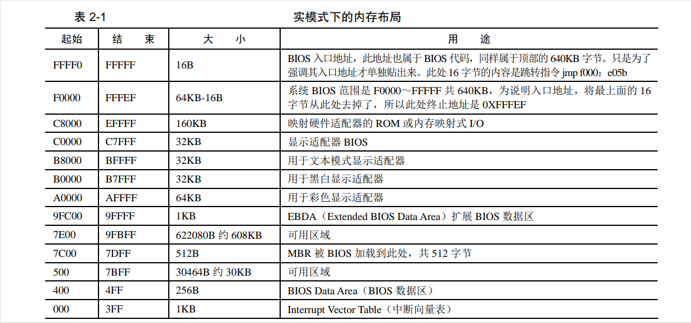

##  载入内存
第一个运行的软件是 BIOS。于是产生了三个问题。
（1）它是由谁加载的。
（2）它被加载到哪里。
（3）它的 cs：ip 是谁来更改的

## BIOS  基本输入输出系统

### 实模式下的 1MB 内存布局
20 就是1MB
0x00000 到 0xFFFFF（一个4）

 0～0x9FFFF处是的DRAM（动态随机存取存储器）。
动态性：由于电容器会逐渐放电，存储的数据需要定期刷新（一般每几毫秒一次）以维持其有效性。

表 2-1，看顶部的 0xF0000～0xFFFFF，这 64KB 的内存是 ROM。
ROM（只读存储器，Read-Only Memory）是一种非易失性存储器，主要用于存储固件或软件，
通常在计算机和其他电子设备中使用。与随机访问存储器（RAM）不同，ROM中的数据在设备断电后仍然保持不变。

BIOS 的主要工作是检测、初始化硬件，怎么初始化的？硬件自己提供了一些初始化的功能调用，BIOS 直接调用就好了。BIOS 还做了一件伟大的事情，建立了中断向量表，这样就可以通过“int 中断号”来实现相关的硬件调用，当然 BIOS 建立的这些功能就是对硬件的 IO 操作，也就是输入输出，但由于就 64KB 大小的空间，不可能把所有硬件的 IO 操作实现得面面俱到，而且也没必要实现那么多，毕竟是在实模式之下，对硬件支持得再丰富也白搭，精彩的世界是在进入保护模式以后才开始，所以挑一些重要的、保证计算机能运行的那些硬件的基本 IO 操作，就行了。这就是 BIOS 称为基本输入输出系统的原因。

> 在 CPU 眼里，为什么我们插在主板上的物理内存不是它眼里“全部的内存”?
>在计算机中，并不是只有咱们插在主板上的内存条需要通过地址总线访问，
还有一些外设同样是需要通过地址总线来访问的。

###  BIOS 是如何苏醒的 

