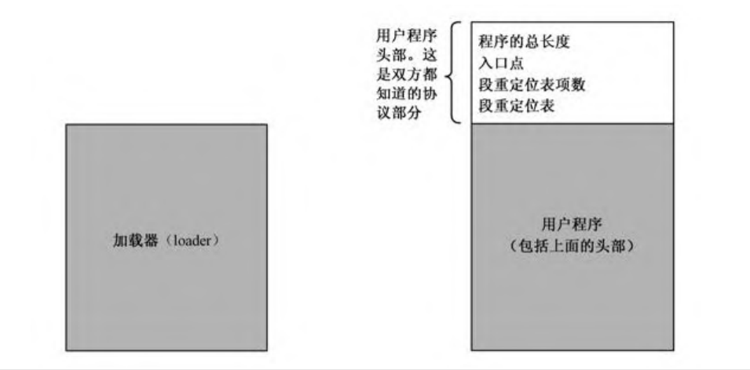

第9章　硬盘和显卡的访问与控制
352
1. 模拟操作系统加载应用程序的过程，演示段的重定位方法，最终使你彻底理解8086处理器的分段内存管理机制；

2. 学习x86处理器过程调用的程序执行机制；

3. 以读硬盘扇区和控制屏幕光标为实例，了解x86处理器访问外围硬件设备的方法；

4. 总结jmp和call指令的全部格式；

5. 认识更多的x86处理器指令，如in、out、shl、shr、rol、ror、jmp、call、ret等

定义段：
section 段名称
segment 段名称

### 关于段 
1. 编译器不关心这是什么段，需要你自己定义（你觉得是啥段就是啥段），自己取名字

2. NASM对段的数量没有限制。一些大的程序，可能拥有不止一个代码段和数据段。

3. 指定段的对齐方式，应该使用“align=”子句，并指定一个具体的对齐。比如说，“align=16”就表示段是16字节对齐的，“align=32”就表示段是32字节对齐的

## 
加载器  用户程序 协议
比如说，在用户程序内部的某个固定位置，包含一些基本的结构信息，每个用户程序都必须把自己的情况放在这里，而加载器也固定在这个位置读取。
经验表明，把这个约定的地点放在用户程序的开头

