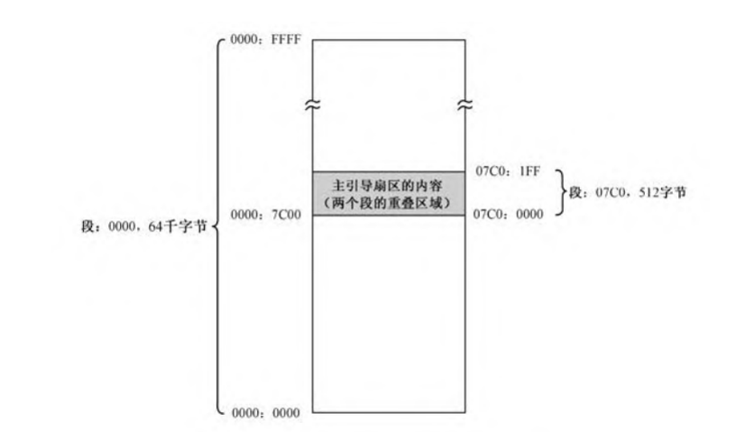
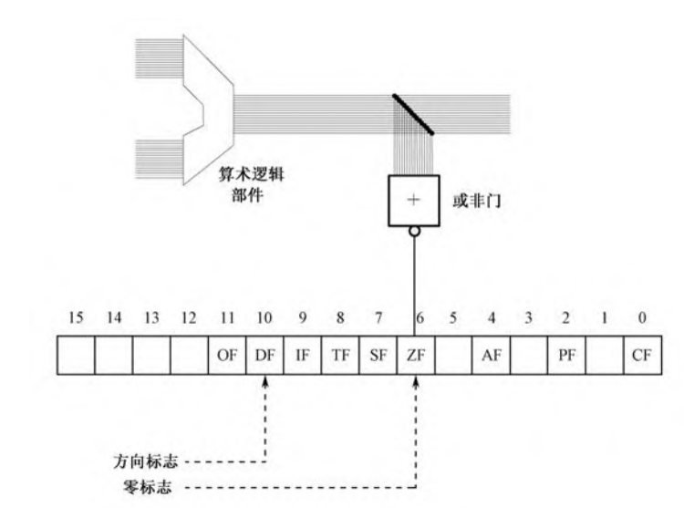
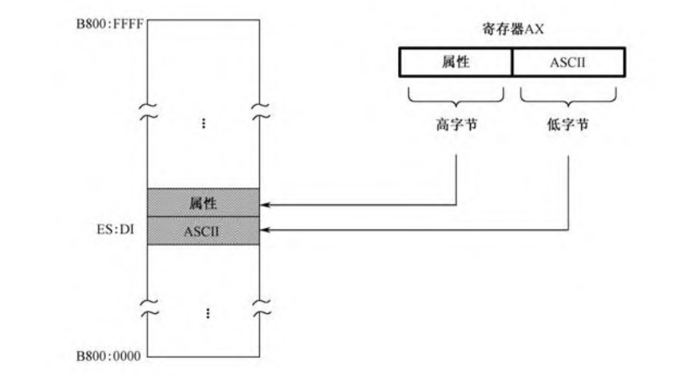

在数据声明中使用字面值

第一时候,使用操作数在把字面值写道显存里面，现在就是专门定义一个来存放字符串的数据区。

# 为什么是0x7c00

512个字节的BOIS主引导扇区为什么是加载到物理地址0x7c00处？
首先，我们其实可以把它看作一个段是从0x7c0:0x000处开始加载的。


``` asm
         mov ax,0x7c0           ;设置数据段的段基地址 
         mov ds,ax    ;将数据段寄存器设置成0x7c0
```
  同时再提一次显示缓冲区为0xb800。
``` asm
         mov ax,0xb800          ;设置附加段基址到显示缓冲区
         mov es,ax    ;将附加段设置成0xb800,显存的地址
```

由于BOIS要找到mbr，如果mbr乱走BOTS就要全部内存都找一边（找0xaa55），所以让mbr就在一个地方等他。由于 0 盘 0 道 1 扇区是磁盘的第一个扇区，mbr 选择了离 BIOS 最近的位置站好了，从此以后再也不担心被 BIOS 骂了。

通电开机之后，BIOS 处理程序开始自检，随后，调用BIOS 中断 0x19h，即 call int 19h。在此中断处理函数中，BIOS 要检测这台计算机有多少硬盘或软盘，如果检测到了任何可用的磁盘，BIOS 就把它的第一个扇区加载到 0x7c00。

现在的版本BIOS是32kb研发的，mbr不是随便放在哪里都行的，首先不能覆盖已有的数据，其次，不能过早地被其他数据覆盖（不让自己覆盖自己）。不覆盖已有数据。8086CPU 要求物理地址 0x0～0x3FF 存放中断向量表。所以32KB换算为十六进制为0x8000，减去 1KB(0x400)的话，等于 0x7c00。

# 段之间的批量数据传送（movsb）


 如果想在屏幕上的显示内容，就要把它们搬到0xB800段去.->8086提供方法
 用movsb或者movsw指令就可以了。

 这两个指令通常将内存中的一段批量传入下一段，movsb是以字节为单位，sw以字为单位。

 原始数据串是由ds指定的，偏移地址是由si决定的。传送字节数和字数的是由cx指定的。（cx用来指定传送字数）
 
 ## FLAGS（标志寄存器）



标志寄存器的第六位是ZF（zero flag），即零标志。

它也允许通过指令设置一些标志来改变处理器的运行状
态。比如，位10是方向标志DF(Direction Flag)，通过将这一位清0或
者置1，就能控制movsb和movsw的传送方向。

``` asm
mov si,message  ;将si寄存器保存message  20行
```
源程序第20行，设置寄存器SI的内容到源串的首地址，也就是标号mytext处的汇编地址。

源程序第21行，设置目的地的首地址到寄存器DI。屏幕上第一个字符
的位置对应着0xB800段的开始处，所以设置DI的内容为0。
                                                                                                  

```
mov di,0 ;di用作目标索引寄存器，常用于字符串操作和数组索引。 21行
mov cx,start-message ; 22行
```
第23行，是movsw指令，操作码是0xA5，该指令没有操作数。使用movsw而不是movsb的原因是按字操作比按字节操作要快。


# 计算机中负数

它知道计算机的负数是做减法`-1`就是`0-1`。但是二进制减法由于进位,结果是......111111111

在计算机中，数字保存在寄存器里，而在16位处理器里，寄存器通常是8位和16位的。因此，以上相减的结果，只能保留最右边的8位或者16位。举个例子，十进制数-1在寄存器AL中的二进制形式是

11111111即0xFF

一个良好的解决方案是，将计算机中的数分成两大类：无符号数和有符号数。无符号数的意思是我们不关心这些数的符号，因此也就无所谓正负，反正它们就是数而已，就像小学生一样，眼中只有自然数。在8位的字节运算中，无符号数的范围是00000000～11111111，即十进制的0～255；在16位的字运算中，无符号数的范围是0000000000000000～1111111111111111，即十进制的0～65535；在将来要讲到的32位运算中，无符号数的范围是000000000000000000000000～11111111111111111111111111111111，即十进制的0～4294967295。很显然，我们以前使用的一直是无符号数。


 8086处理器中有一条专门做这件事的指令。neg指令带有一个操作数，可以是8位或者16位的寄存器，或者内存单元。

 ```
 neg al
 neg dx
 neg word [label_a]
```


同时伪指令db和dw也有这个
``` 
db 255 ;正确 可以看成无符号数
db -125 ;
db -240 ;数据超出字节
dw -240 ;
dw -30001;
```


## 计算机视角下数据类型

无符号数和有符号数的划分并没有从根本上打消我们的疑虑，即假如寄存器AX中的内容是0xB23C，那么，它到底是无符号数45628呢，还是应当将其看成-19908?其实无所谓，看成什么结结果都是正确的。因为有进位机制最大一位会被舍弃。

比如说10-3就是10+(-3)
``` 
mov ah,10
mov al,-3
add ah,al
``` 

处理器还是提供了sub，该指令和加法指令add类似
```
sub ah,al
sub dx,ax
sub [label_a],ch
```
上面这段代码实际上等效于
``` 
neg al
add ah,al
```
neg指令
neg 指令会影响以下标志位：
ZF (Zero Flag)：如果结果为零，则设置。
SF (Sign Flag)：如果结果为负，则设置。
OF (Overflow Flag)：如果操作数为最小负数并且结果为最小负数，则设置。
CF (Carry Flag)：总是被清除。


# 数位的显示

一旦各个位数要分解出来，工作屏幕就要显示它们。源程序第40行，将保存有各个数位的数据区首地址传送到基地址寄存器BX里面。

一共有5个数字要显示，它们在当前数据段内的起始偏移地址就是number的汇编地址，且已传送到寄存器BX。为了依次得到这5个数字，程序中使用的指令是
```
mov al,[bx+si]
```


!!!!INTER8086只允许

```
[bx+si]
[bx+di]
[bp+si]
[bp+di]
```
这些组合可以用于任何带有内存操作数的指令中。其他任何组合，比如［bx+ax］、［cx+dx］、［ax+cx］等，都是非法的。

指令`jns show`的意思是，如果未设置符号位，则转移到标号“show”所在的位置处执行。



## 进位标志CF

## 溢出标志OF
