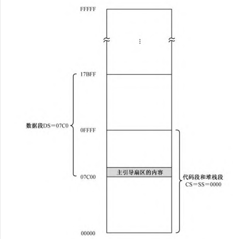
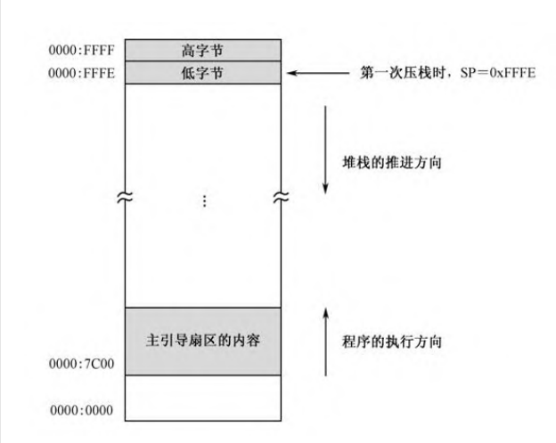

# 开始问题  
1. 通过计算1到100的累加和，学习一种重要的数据结构——栈，了解
处理器为访问栈提供了怎样的支持；
    >栈 由段寄存器SS指向（一个段的首地址）和栈指针SP的寻址是在SS:SP

2. 总结INTEL8086处理器的寻址方式；
    >
3. 学习几个新的处理器指令，它们是or、and、push和pop；
    >or 或操作 and &操作 push 压栈 pop 出栈
4. 学习在Bochs中调试程序时查看栈的方法。
    >

##  显示字符串

本次采用的是循环指令loop。loop指令的工作又依赖于寄存器`CX`，所以，源程序第20行，用于在编译阶段计算一个循环次数，该循环次数等于字符串的长度（字符个数）。

循环体是从第22行开始的，将数据段中的逻辑地址为DS：SI的地方取得的第一个地址，取得第一个字符，将七传送到逻辑地址ES:DI后者指向显示器的缓冲区。

紧接着 
```
    inc di 
    mov byte [es:di],0x07 ;显示属性
    inc di
```
在将di加1

## 累计的各个数位的分解

### 8.5.1 栈和栈段的初始化

和前面不同，各个数位保存在栈上（以前保存在数据段上）

和代码段、数据段和附加段一样，栈也被定义成一个内存段，叫栈段(Stack Segment)，由段寄存器SS指向。

定义栈需要两个连续的步骤，即初始化段寄存器SS和栈指针SP的内
容。
```
    xor cx,cx              ;设置堆栈段的段基地址
    mov ss,cx
    mov sp,cx
```
线程的内存布局


    总的内存容量是1MB,物理地址范围是0x00000到0xfffff假定数据段的长度是64KB（实际上它的长度无关紧要），占据了物理地址0x07C00～0x17BFF，对应的逻辑地址范围是0x07C0:0x0000～0x07C0:0xFFFF；代码段和栈段是同一个段，占据着物理地址0x00000～0x0FFFF，对应的逻辑地址范围是0x0000:0x0000～0x0000:0xFFFF。


### 分解各个数位并压栈

分解数位还是的靠做除法，
把除数写进bx
```
  mov bx,10
  xor cx,cx
```
以往分解寄存器AX中的数时，固定是分解5次，得到5个数位。但这也存在一个缺点，如果AX中的数很小时，在屏幕上显示的数左边都是“0”，这当然是很别扭的。为此，本章的源程序做了改善，每次除法结束后，都做一次判断，如果商为0的话，分解过程可以提前结束。

将DX清零，并和AX一起形成32位的被除数。
```
 xor dx,dx ;清零dx
 div bx ;
 or dl,0x30 ;直接加上ascll码
```
#### or and
与xor一样，or也是逻辑运算指令。不同之处在于，or执行的是逻辑“或”。数字逻辑中的“或”用于表示两个命题并列的情况。（只要有1就是1）
就有加上的因为ascll码0x30是3*16-->48前4位都是0所有直接或得到ascll码

处理器内部，or指令的目的操作数可以是8位或者16位的通用寄存器，或者包含8/16位实际操作数的内存单元，源操作数可以是与目的操作数数据宽度相同的通用寄存器、内存单元或者立即数。

or指令不允许目的操作数和源操作数都是内存单元的情况出现。

or指令对标志寄存器的影响是：OF和CF位被清零，SF、ZF、PF位的状态依计算结果而定，AF位的状态未定义。
与or对应的是and（&）

#### push 压栈

push指令的作用是将寄存器DX的内容压入栈中.push(只接受16位的操作数)
```
 push dx
```
后面其他的处理可以，但是在8086中，只能压入16
非法操作
``` 
push al
push byte [label_a]
```
同时执行push操作时，会将寄存器的sp做减去操作数的字长（（以字节为单位的长度，在16位处理器上是2），然后把压入栈的数据存放到逻辑地址ss:sp .（和其他段的读写一样，把栈段寄存器SS的内容左移4位，加上栈指针寄存器SP提供的偏移地址）


#### 为什么重叠区不会影响！

    图8-3所示，代码段和栈段是同一个段，所以段寄存器CS和SS的内容都是0x0000。而且，栈指针寄存器SP的内容在源程序第42行被置为0。所以，当push指令第一次执行时，SP的内容减2，即0x0000-0x0002=0xFFFE，借位被忽略。于是，被压入栈的数据，在内存中的位置实际上是0x0000:0xFFFE。push指令的操作数是字，而且INTEL处理器是使用低端字节序的，故低字节在低地址部分，高字节在高地址部分，正好占据了栈段的最高两个字节位置。



#### pop
    处理器将栈段寄存器SS的内容左移4位，再加上栈指针寄存器SP的内容，形成20位的物理地址访问内存，取得所需的数据。


## 栈！

push执行后，压入栈中仅仅是该寄存器或者内存单元里的数值，与该寄存器或者内存单元不再相关。
push cs（将代码寄存器内容压栈）
pop ds  (弹出数据段的寄存器ds)
所以是栈和数据段一样的

保持栈的平衡意思是将入栈出栈平衡

## 8086处理器的寻址方式

多数指令操作的是数值，比如mov ，add 这种   

寻址方式：寄存器寻址，立即寻址，内存寻址


```
add bx,0xf000
mov dx,label_a
```
### 内存寻址

传统上，这是两种速度较快的寻址方式。但是，它们也有局限性。一方面，我们不可能总是知道要操作的数是多少，因此也就不可能总是在指令中使用立即数；另一方面，寄存器的数量有限，不可能总指望在寄存器之间来回倒腾。


所谓的内存寻址方式，就是如何在指令中指定操作数的偏移地址，供处理器访问内存时使用，这个偏移地址也叫有效地址（EA）。换句话说，内存寻址方式就是在指令中指定偏移地址（有效地址）如何计算。

#### 直接寻址

在这种寻址方式中，偏移地址（有效地址）直接给出。是一个标号或者手自直接给数值。
```
mov ax,[0x5c0f];直接寻址，
add word [0x0230],0x5000
xor byte [es:label_b],0x05
```

第一条处理器将数据段寄存器DS的内容左移4位，加上这里的0x5c0f，形成20位物理地址。

第二条 处理器用同样的方法，访问由段寄存器DS指向的数据段，并把指令中的立即数加到该段中偏移地址为0x0230的字单元里。

#### 基址寻址

我们会有一大堆的数据要处理，而且它们通常都是挨在一起顺序存放的。比如
```
buffer dw 0x20 0x100 0x0f 0x300 0xff00
```
假如要将这些数据统统加1，那么，使用直接寻址的指令序列肯定是这样的：
```
inc word [buffer]
inc word [buffer+2]
```

考虑到简洁性 

```
mov [bx],dx
add byte [bx],0x55;目的操作数也采用的是基址寻址
```
就可以变成
```
mov bx, buffer
inc word [bx]
inc word [bx+2]
```

有什么好处吗？？

在基址寻址方式中，基址寄存器也可以是BP。->后面有

#### 如何将栈

```
mov ax,0x5000
push  ax
mov ax,0x7000
push ax
```
上面的代码只能用pop读出（而且先0x7000弹出）

这个时候bp就有用了
```
mov ax,0x5000
push ax
mov bp,sp
mov ax,0x7000
push ax
mov dx,[bp]
```
以上，在压入0x5000之后，立刻将栈指针sp保存到bp（就是。。存以下指针）
```
mov dx,[bp-2]
```

这样的话

```
mov bx,buffer
mov cx,5
lpinc:
    inc word [bx]
    add bx,2
    loop lpinc
```
这段的话就可以循环加一了

### 变址寻址

变址寻址类似于基址寻址，唯一不同之处在于这种寻址方式使用的是变址寄存器（或称索引寄存器）SI和DI。例如
```
mov [si],dx
add ax,[di]
xor word [si],0x8000
```
基址寻址一样，当带有这种操作数的指令执行时，除非使用了段超越前缀，处理器会访问由段寄存器DS指向的数据段，偏移地址由寄存器SI或者DI提供。

同样的，变址寻址方式也允许带一个偏移量
