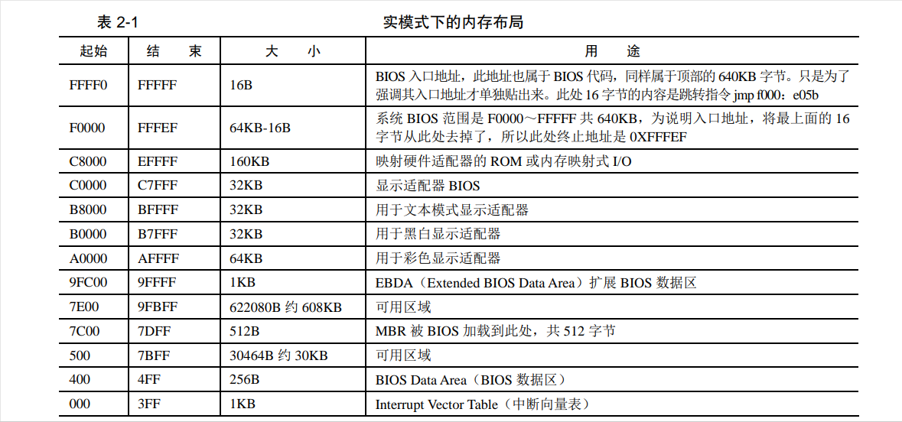

##  载入内存
第一个运行的软件是 BIOS。于是产生了三个问题。
（1）它是由谁加载的。
（2）它被加载到哪里。
（3）它的 cs：ip 是谁来更改的

## BIOS  基本输入输出系统

### 实模式下的 1MB 内存布局
20 就是1MB
0x00000 到 0xFFFFF（一个4）

 0～0x9FFFF处是的DRAM（动态随机存取存储器）。
动态性：由于电容器会逐渐放电，存储的数据需要定期刷新（一般每几毫秒一次）以维持其有效性。

表 2-1，看顶部的 0xF0000～0xFFFFF，这 64KB 的内存是 ROM。
ROM（只读存储器，Read-Only Memory）是一种非易失性存储器，主要用于存储固件或软件，
通常在计算机和其他电子设备中使用。与随机访问存储器（RAM）不同，ROM中的数据在设备断电后仍然保持不变。

BIOS 的主要工作是检测、初始化硬件，怎么初始化的？硬件自己提供了一些初始化的功能调用，BIOS 直接调用就好了。BIOS 还做了一件伟大的事情，建立了中断向量表，这样就可以通过“int 中断号”来实现相关的硬件调用，当然 BIOS 建立的这些功能就是对硬件的 IO 操作，也就是输入输出，但由于就 64KB 大小的空间，不可能把所有硬件的 IO 操作实现得面面俱到，而且也没必要实现那么多，毕竟是在实模式之下，对硬件支持得再丰富也白搭，精彩的世界是在进入保护模式以后才开始，所以挑一些重要的、保证计算机能运行的那些硬件的基本 IO 操作，就行了。这就是 BIOS 称为基本输入输出系统的原因。

> 在 CPU 眼里，为什么我们插在主板上的物理内存不是它眼里“全部的内存”?
>在计算机中，并不是只有咱们插在主板上的内存条需要通过地址总线访问，
还有一些外设同样是需要通过地址总线来访问的。

###  BIOS 是如何苏醒的 

BIOS 代码所做的工作也是一成不变的，而且在正常情况下，其本身是不需要修改的，平时听说的那些主板坏了要刷 BIOS 的情况属于例外。
于是 BIOS 顺理成章地便被写进此 ROM(只读存储器)。
ROM 也是块内存，内存就需要被访问。
此ROM被映射在低端 1MB 内存的顶部，即地址 0xF0000～0xFFFFF 处，
可以参考表 2-1 顶部的 BIOS部分。
只要访问此处的地址便是访问了 BIOS，这个映射是由硬件完成的。

>BIOS 本身是个程序，程序要执行，就要有个入口地址才行，此入口地址便是 0xFFFF0

>CPU 中的 cs：ip 值是如何组合成 0xFFFF0 的?
\
接电的一瞬间，CPU 的 cs：ip 寄存器被强制初始化为 0xF000：0xFFF0。

> 第一个 bios是jmp far f000：e05b，这是条跳转指令，在0xFFFF0 的跳转到0xfe05b。
\
asw

---
### 
于 0 盘 0 道 1 扇区

CHS 方法，即柱面 Cylinder 磁头 Header 扇区 Sector
CHS 方式中扇区的编号是从 1 开始的，所以这个1也是开始。

