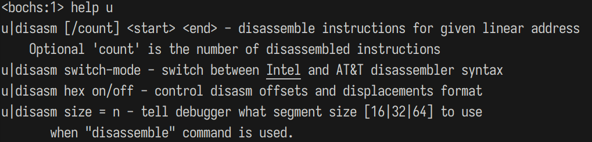

# 完善MBR(主引导记录)

## 地址、section、vstart 

### 地址
距第一个符号的距离便是它们在程序中的地址。

上述的偏移量本质上就是地址，每个变量的地址是前一个变量的地址+前一个变量的内存空间大小

第 1 行和第 4 行的 mov 的机器码中第 1 字节都是 B8，其原因是寻址方式都是立即数。

cwd（将word转化成double word）

大概意思是 section 用 vstart=来修饰后，可以被赋予一个虚拟起始地址 virtual start address(强调了这个是虚拟的地址)

code.节名.start== 节在整个程序的地址，相当于与文件开头的偏移量

## ret call 

>ret 作用 ：从栈顶获取2个字节的字数，放进ip寄存器里面\
retf作用： 从栈顶获取4个字节，放进cs:ip里面

（用栈顶元素改变cpu执行流，正确与否由程序员）

call指令和ret是一对配合\
call far 和retf是一对配合
### call 实模式

8086 处理器有两个指令能实现改变程序的流程 一个是jmp，一个是call。区别是jmp属于不回头的执行新代码，适用于`交接`，比如说BIOS交给MBR。call属于执行万一段分支之后再回来的情况，他回来要用retf或者ret配合。
call实现一个函数的调用，有四种方式。
(第一二种，近调用，34远调用)

---

#### 16 位实模式相对近调用
1. 相对近调用概念
 
- 什么是`近`？  目标函数和当前代码在同一段内，不用切换段（基地址），只用给段内偏移量   
- 什么是`相对`？  在同一个代码段中，所以只要给出目标函数的相对地址即可。

2. 格式：
```
call near 立即数地址
```
- 操作数是立即数(near可以省略)。这里的立即数可以是被调用的函数名，也可以是标号，立即数。反正最后编译器都会换成实际的数字。

- 最后的操作数是call指令对于目标的偏移量（就是说是地址差）。

3. call的编译器转换地址

- 比如说指令`call near 0x1234` 他的机械码是e8llhh。
由于x86是小端，所以说ll是低位，hh是高位。实际跳转目标为hhll。 
- 
4. 相对近调用的优势
    
- 由于操作数是相对地址，因此代码位置的改变不会影响指令的执行，提高了代码的可移植性。
- 相对地址的计算由编译器完成，简化了开发人员的工作。
5. 代码
``` assembly
call near near_proc
jmp $
addr dd 4
near_proc：
	mov ax， 0x1234
	ret
```
`call near near_proc`的操作码是`e8 06 00` 

- `e8`是`call near`的操作码。
- `06 00`操作数, 表示目标函数 `near_proc` 的地址相对于当前 `call` 指令地址的偏移量为6。
    - 当前指令地址是0x900
    - 目标函数是0x909
    - 操作数是06，是因为指令大小为3

#### 16 位实模式间接绝对近调用
1. 概念
- `绝对`是指 目标函数地址是绝对地址。
- `间接`  值 相对的地址要么在内存中，要么寄存器中，反正不是立即数
- `近`，其实就是替换ip的地址（跟上一个一样）
2. 指令形式
```assembly
call ax        ; call 寄存器地址 
call [0x1234]  ; call 内存寻址
```
- 内存寻址的操作码是ff16，机器码是 `ff16+16位内存地址` 。
- 如果是寄存器寻址，机器码与寄存器相关 call ax是ffd0 cx是ddd1 。
3. 代码
``` assembly
section call_test vstart=0x900 
mov word [addr], near_proc 
call [addr]  ;3 
mov ax, near_proc ;4
call ax  ;5
jmp $ 
addr dd 4 
near_proc: 
mov ax, 0x1234 
ret
```
- 第三行是用内存在调用的。
    - 第七行是定义了 addr 是4个字节的变量(dd)。
    - near_proc是函数名,用word告诉编译器读两个字节
- 第五行使用寄存器调用的。

> 注意，寄存器寻址中，若在寄存器名称前添加数据类型伪指令，编译器会报警告：“warning： register size specification ignored”。警告信息字面上的意思是寄存器大小被忽略。只是提示警告，不影响编译，编译的机器码依然是正确的。

#### 16 位实模式直接绝对远调用

1. 概念
- `远` 跨段（使用cs:ip寄存器）
- 
2. 格式
``` assembly
call far 段基地址（立即数）：段内偏移地址（立即数）
```
 - 对于绝对远调度far可以不加
3. 代码
``` assembly
section call_test vstart=0x900 
call 0：far_proc 
jmp $ 
far_proc：
mov ax， 0x1234 
retf 
```


#### 16 位实模式间接绝对远调用

1. 格式
``` assembly
call far 内存寻址
```

## jmp

1. 概念
- jmp 转移指令只要更新 CS：IP 寄存器或只更新 IP 寄存器就好了，不需要保存它们的值，所以跳到新的地址后没办法再回来，它属于“一去不回头”地去执行新指令。

2. 分类
- 和 call 一样，按远近（是否跨段）来划分，大致分为两类，近转移、远转移。不过在转移方式中，还有个更近的，叫短转移。

### 相对短转移

1. 格式
``` assembly
jmp short 立即数地址
```
2. 概念

- `相对`意味着操作数是个相对增量，相对短转移的机器码大小是 2 字节，操作码是 0xeb

> 关键字 short 是指明让 nasm 编译器将 jmp 编译为相对短转移的形式，如果条件不满足 short 的要求，即操作数大小不满足-128～127 的范围，则会编译失败

3.代码 
``` assembly
section call_test vstart=0x900 
jmp short start 
times 127 db 0 
start：
mov ax， 0x1234 
jmp $ 
```
### 相对近转移

1. 格式
```assembly
jmp near reg
```
2. 概念
- 相对`近`转移和相对`短`转移相比，就是操作数范围增大了，由 8 位宽度变成了 16 位宽度，操作数依然是地址相对量，可正可负，范围是-32768～32767。由此可见，概念`近`比`短`表示的范围更远一点。
- 操作数为0xe9
- 跳转绝对地址=操作数+IP寄存器的值+3
### 间接绝对近转移
1. 概念
- `jmp 相对近转移`相比，本`间接绝对近转移`其目标地址是绝对地址

- 操作码是`0xff`

2. 格式
```
jmp near 寄存器寻址 && jmp near 内存寻址
```
- 若操作数在内存中，在不使用段跨越前缀的情况下，段基址寄存器是 DS

3. 代码
```assembly
section call_test vstart=0x900 
mov ax,start 
jmp near ax 
times 128 db 0 
start：
mov ax， 0x1234 
jmp $ 
```

### 直接绝对远转移

1. 概念

- `直接`是操作数不仅是立即数，而且cpu直接用，不转化
- `绝对`是指操作数的绝对地址
- `远`是 不是一个段的 

2. 代码
```assembly
section call_test vstart=0x900 
jmp 0：start 
times 128 db 0 
start：
mov ax， 0x1234 
jmp $ 
``` 
### 间接绝对远转移
1. 概念
- 如果分割就是 `间接` `绝对` `远`这三个，对比上一个就是`直接`变`间接`。
- 操作数不是直接给出的，即段基址和段内偏移不是立即数的形式
jmp far 内存寻址。

2. 代码
```assembly
section call_test vstart=0x900 
jmp far [addr] 
times 128 db 0 
addr dw start，0 
start：
mov ax， 0x1234 
jmp $
```

##  标志寄存器flags
> 按理说，既然有“无条件转移”，就应该有“有条件转移”，真实情况也确实是这样。讲完了无条件转移指令后，该到有条件转移指令啦，可是我们得知道这个条件在哪里，是什么条件。这样我们才能根据这些条件做出是否转移的判断。
- `eflags`寄存器是对于`flags`的`extend`。


## 有条件转移
1. 概念
- 有条件转移不是简单的一个指令，它是一个指令族
- 简单称 `jxx`

2. 格式
```
jxx 目标地址
```
- 其中`目标地址`是`段内偏移地址`
    - 在实模式下，由编译器根据当前指令与目标地址的偏移量，自行将其编译成短转移或近转移。
    - 在保护模式下，寄存器中宽度已经到了 32 位，32 位的偏移地址可以访问到整个 32 位地线总线的 4GB 内存空间，编译器不再区分转移方式。


# 对显示器
## CPU 如何与外设通信—IO 接口 

>任何不兼容的问题，都可以通过增加一“层”来解决。在 CPU 和外设之间的这一层就是 IO 接口。

IO 接口是连接 CPU 与外部设备的逻辑控制部件，既然称为逻辑，就说明可分为硬件和软件两部分。(･ｪ-)  

- 内部总线
    - 负责处理IO竞争
    - 别名`输入输出控制中心` ,`南桥芯片`
        - `北桥`是散热片
    - 在南桥内部集成了一些 IO 接口

    
- 信号线
    - 物理链路
    - 大家共享,所以叫`总线`
- 接口
    - 接口作用是连接外部设备和外部设备
    - IO接口功能:
        1. 设置数据缓冲，解决 CPU 与外设的速度不匹配
        - 提供缓冲区
        2. 设置信号电平转换电路
        3. 设置数据格式转换
        4. 设置时序控制电路来同步 CPU 和外部设备
        5. 提供地址译码

- IO端口
    - 被设计成要通过寄存器的方式同 CPU 通信，其内部有专用于数据交互的寄存器,这些寄存器被叫`端口`
    - IA32 体系系统中，因为用于存储端口号的寄存器是 16 位的，所以最大有65536 个端口，即 0～65535。
    - 要是通过`内存映射`，端口就可以用 mov 指令来操作。但由于用的是独立编址，所以就不能把它当作内存来操作，因此 CPU 提供了专门的指令来干这事，`in` 和 `out`。
        1. in 读取数据
    ```assembly
    in al,dx
    in ax,dx
    ```
     - 其中 al 和 ax 用来存储从端口获取的数据，dx 是指端口号
       
        2. out 写数据
    ```
    out dx,al
    out dx,ax
    out 立即数,al
    out 立即数,ax
    ```
    1. 不同:
    - in 指令的源操作数是端口号，而 out 指令中的目的操作数是端口号。
    2. 相同:
    -  在以上两个指令中,dx只做端口号之用，无论其是源操作数或目的操作数
    - in 指令从端口读数据，可以认为端口是数据源，所以端口出现在“源操作数”的位置
    - in 指令中，端口号只能用 dx 寄存器
    - out 指令中，可以选用 dx 寄存器或立即数充当端口号。

## 显卡
- mbr 运行在实模式下，所以在实模式下也可以用 BIOS 的 0x10 中断打印字符串
- 字符属性

P122

## 改进mbr,直接操作显卡

- 代码在 boot/mbr.S(第二版)
- 把第一个字符1的ascll码,gs: 0x00,(gs是0xb800,显存的第一个),所以'1'在显存的第一个字节

``` assembly
;主引导程序 第二版通过显卡实现
; 
;LOADER_BASE_ADDR equ 0xA000 
;LOADER_START_SECTOR equ 0x2 
;------------------------------------------------------------
section mbr vstart=0x7c00
mov ax ,cs
mov ds,ax
mov es,ax
mov ss,ax
mov fs,ax
mov sp,0x7c00
mov ax,0xb800
mov gs,ax 
;清屏
;利用 0x06 号功能，上卷全部行，则可清屏
; ----------------------------------------------------------- 
;INT 0x10 功能号：0x06 功能描述：上卷窗口
;------------------------------------------------------ 
;输入：
;AH 功能号= 0x06 
;AL = 上卷的行数（如果为 0，表示全部）
;BH = 上卷行属性
;(CL,CH) = 窗口左上角的(X,Y)位置
;(DL,DH) = 窗口右下角的(X,Y)位置
;无返回值: 
mov ax,0600h
mov bx,0700h
mov cx,0            ; 左上角: (0, 0)
mov dx,184fh        ; 右下角: (80,25)
                    ; VGA 文本模式中，一行只能容纳 80 个字符，共 25 行
                    ; 下标从 0 开始，所以 0x18=24，0x4f=79
INT 10h             ;
; 输出背景色绿色，前景色红色，并且跳动的字符串"1 MBR"

mov byte [gs:0x00],'1' 
mov byte [gs:0x01],0xA4 ; A 表示绿色背景闪烁，4 表示前景色为红色
 
mov byte [gs:0x02],' ' 
mov byte [gs:0x03],0xA4 

mov byte [gs:0x04],'M' 
mov byte [gs:0x05],0xA4 

mov byte [gs:0x06],'B' 
mov byte [gs:0x07],0xA4 

mov byte [gs:0x08],'R' 
mov byte [gs:0x09],0xA4

jmp $
times 510-($-$$) db 0
db 0x55, 0xaa
```


## bochs调试方法
### bochs 一般用法
- 原则上只要 gcc 支持某个平台，这个平台上就可以有 bochs，从而保证了 bochs 在各平台上的畅通无阻。由于它是虚拟机，所以支持硬件级别上的调试

1. help 


#### x xp 指定显示单元

- 有 x、xp 命令。这两个命令是用来查看内存的，它们的区别是x 命令后接线性地址，xp 命令后接 physical 物理地址。

    - 'xp /nuf <addr>',中`nuf`是指一个数字序列,
```sh
<bochs:6> xp/b 0x7c00
[bochs]:
0x0000000000007c00 <bogus+       0>:    0x00
<bochs:7> xp 0x7c00
[bochs]:
0x0000000000007c00 <bogus+       0>:    0x00
```
    
- 现在输入发现 0x7c00的地址是空的(因为bios还没有还是加载)😋

这里0x2f3330f0是在0xffff0上的机器码
#### 反汇编指令 u

- u 和 disasm 是一样的命令


info ivt [num]显示中断向量表 IVT


## 硬盘介绍

终于看到硬盘了🫨

😍😍😍😍😍🥰🥰🥰🥰🥰🥰🥰

- 硬盘工作原理:


### 如何控制硬件(硬件控制端口)
- 硬盘控制器属于 IO 接口。(硬件端口属于寄存器有in/out来控制)
- 用到的硬盘端口范围


- 端口可以被分成两`组`
    - Command Block registers，用于向硬盘驱动器`写入命令`字或者从硬盘控制器`获得`硬盘状态
    - Control Block registers，用于`控制`硬盘工作状态
- Control组的寄存器已经被精简了，开始说`Command`组。
    


### 常用的硬盘操作方法

> 硬盘中的指令很多，各指令的用法也不同。有的指令直接往 command 寄存器中写就行了，有的还要在 feature 寄存器中写入参数

- 主要顺序：command寄存器一定最后写，写完硬盘就要干活了
    
    1. 先选择通道，往该通道的 sector count 寄存器中写入待操作的扇区数
    2. 往该通道上的三个 LBA 寄存器写入扇区起始地址的低 24 位
    3. 往 device 寄存器中写入 LBA 地址的 24～27 位，并置第 6 位为 1，使其为 LBA 模式，设置第 4位，选择操作的硬盘（master 硬盘或 slave 硬盘）
    4. 往该通道上的 command 寄存器写入操作命令。
    5. 读取该通道上的 status 寄存器，判断硬盘工作是否完成。
    6. 如果以上步骤是读硬盘，进入下一个步骤。否则，完工
    7. 将硬盘数据读出。
- 数据传送方式
    
    1. 无条件传送方式。
    2. 查询传送方式。
    3. 中断传送方式。
    4. 直接存储器存取方式（DMA）。
    5. I/O 处理机传送方式

## 让mbr使用硬盘

> 我们的 MBR 受限于 512 字节大小的，在那么小的空间中，没法为内核准备好环境，更没法将内核成功加载到内存并运行。所以我们要在另一个程序中完成初始化环境及加载内核的任务，这个程序我们称之为 loader，即`加载器`。

---
1. Loader在第一扇区
    - 因为mbr是lba方式在0开始,如果是物理chs方式编号从1开始
2. Loader在那里读出来
    - 只要在“用途”列中注明“可用区域”的地方都可以用。0x500～0x7BFF 和 0x7E00～9FBFF 这两段内存区域都可以。
3. Loader中要定义一些数据结构，之后内核要用所以loader加载进内存后就不能被覆盖。
4. 由于之后内核越来越大所以内存地址也会越来越高，所以我们把loader放第一点，给内核一点空间。
    - 所以，我将 loader 的加载地址选为 0x900。为什么不是 0x500，这个多省空间？还是预留出一定空间吧，彼此隔开远一点心里才踏实，不差这点空间了。
```assembly
;主引导程序
;------------------------------------------------------------ 
%include "boot.inc" 
section mbr vstart=0x7c00
    mov ax,cs
    mov ds,ax
    mov es,ax
    mov ss,ax
    mov fs,ax
    mov sp,0x7c00
    mov ax,0xb800
    mov gs,ax
     
 ;清屏
 ;利用 0x06 号功能，上卷全部行，则可清屏
 ; ----------------------------------------------------------- 
 ;INT 0x10 功能号：0x06 功能描述：上卷窗口
 ;------------------------------------------------------ 
 ;输入：
 ;AH 功能号= 0x06 
 ;AL = 上卷的行数（如果为 0，表示全部）
 ;BH = 上卷行属性
 ;(CL,CH) = 窗口左上角的(X,Y)位置
 ;(DL,DH) = 窗口右下角的(X,Y)位置
 ;无返回值：
    mov ax,0600h
    mov bx,0700h
    mov cx,0        ;左上角: (0, 0) 
    mov dx,184fh    ; 右下角: (80,25), 
; 因为 VGA 文本模式中，一行只能容纳 80 个字符，共 25 行
; 下标从 0 开始，所以 0x18=24，0x4f=79
    int 10h

    ;输出字符串
    mov byte [gs:0x00],'1' 
    mov byte [gs:0x01],0xA4 
 
    mov byte [gs:0x02],' ' 
    mov byte [gs:0x03],0xA4 

    mov byte [gs:0x04],'M' 
    mov byte [gs:0x05],0xA4
    ;A 表示绿色背景闪烁,4 表示前景色为红色
    mov byte [gs:0x06],'B' 
    mov byte [gs:0x07],0xA4 
 
    mov byte [gs:0x08],'R' 
    mov byte [gs:0x09],0xA4 

    mov eax,LOADER_START_SECTOR ;起始扇区lba地址
    mov bx,LOADER_BASE_ADDR     ;写入的地址
    mov cx,1                    ;带写入的扇区数
    call rd_disk_m_16           ;以下读取程序的起始部分

    jmp LOADER_BASE_ADDR
;------------------------------------------------------------------------------- 
;功能:读取硬盘 n 个扇区
rd_disk_m_16: 
;------------------------------------------------------------------------------- 
; eax=LBA 扇区号
; bx=将数据写入的内存地址
; cx=读入的扇区数
    mov esi,eax ;备份eax
    mov di,cx   ;备份cx
;读写硬盘
;第一步：设置要读取的扇区数
    mov dx,0x1f2
    mov al,cl
    out dx,al   ;读取的扇区数

    mov eax,esi ;恢复ax

;第 2 步:将 LBA 地址存入 0x1f3 ～ 0x1f6

    ;LBA 地址 7～0 位写入端口 0x1f3 
    mov dx,0x1f3
    out dx,al
    
    ;LBA 地址 15～8 位写入端口 0x1f4
    mov cl,8
    shr eax,cl
    mov dx,0x1f4
    out dx,al
    
    ;LBA 地址 23～16 位写入端口 0x1f5
    shr eax,cl
    mov dx,0x1f5
    out dx,al
    
    shr eax,cl
    and al,0x0f ;lba第24~27位
    or al,0xe0  ;设置7~4位为1110  ，表示lba模式
    mov dx,0x1f6 
    out dx,al

;第3步 向0xlf7端口写入读写命令0x20
    mov dx,0x1f7
    mov al,0x20
    out dx,al

;第四步，检查硬盘状态
.not_ready:
    ;同一端口，写是表示写入命令字，
nop 
in al,dx 
and al,0x88 ;第 4 位为 1 表示硬盘控制器已准备好数据传输
 ;第 7 位为 1 表示硬盘忙
cmp al,0x08 
jnz .not_ready ;若未准备好,继续等

;第 5 步:从 0x1f0 端口读数据
mov ax, di 
mov dx, 256 
mul dx 
mov cx, ax 
; di 为要读取的扇区数,一个扇区有 512 字节,每次读入一个字
; 共需 di*512/2 次,所以 di*256 
mov dx, 0x1f0 
.go_on_read: 
in ax,dx 
mov [bx],ax 
add bx,2 
loop .go_on_read 
ret 

times 510-($-$$) db 0 
db 0x55,0xaa
```

## 实现内核加载器

loader 是要经过实模式到保护模式的过渡，并最终在保护模式下加载内核。

```assembly
%include "boot.inc"
section loader vstart=LOADER_BASE_ADDR

;输出背景绿色，前景色红色，并且跳动的字符串‘1 MBR’
mov byte [gs:0x00],'2'
mov byte [gs:0x01],0xA4 ;A表示绿色背景闪烁，4表示前景色为红色

mov byte [gs:0x02],' '
mov byte [gs:0x03],0xA4

mov byte [gs:0x04],'L'
mov byte [gs:0x05],0xA4

mov byte [gs:0x06],'O' 
mov byte [gs:0x07],0xA4

mov byte [gs:0x08],'A' 
mov byte [gs:0x09],0xA4 

mov byte [gs:0x0a],'D' 
mov byte [gs:0x0b],0xA4

mov byte [gs:0x0c],'E'
mov byte [gs:0x0d],0xA4

mov byte [gs:0x0e],'R' 
mov byte [gs:0x0f],0xA4

jmp $ ; 通过死循环使程序悬停在此
```

这段代码是验证能不能从mbr跳转到loader的

