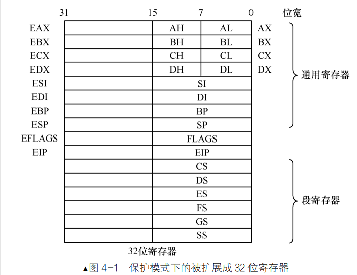

# 4 保护模式入门
## 保护模式
### 为什么要有保护模式
- 安全原因
    - 实模式下操作系统和用户程序属于同一特权极
    - 用户程序引用的地址都指向真是物理地址
    - 用户程序可以自由的修改段地址，可以自由改
- 使用原因
    -  访问64kb就要切换地址
    - 一次只能运行一个程序
    - 内存最大只能用1mb，太小了

因此程序内部的地址（虚拟地址）需要被转化为物理地址后再去访问，程序对此一无所知。顺便说一句，地址转换是由处理器和操作系统共同协作完成的，处理器在硬件上提供地址转换部件，操作系统提供转换过程中所需要的页表。

### 实模式不是 32 位 CPU，变成了 16 位

- 实模式时，指的是 32 位的 CPU 运行在 16 位模式下的状态，不是 CPU 变身成的16位。

### 保护模式之寄存器扩展

- 32位寄存器在原本寄存器的情况



- 左边已经标注名字的寄存器有通用寄存器组，名字前统一加了字符 E 表示扩展

- 全局描述符表
    - 为了更加安全，怎么也得多添加点约束条件才靠谱。这些“约束条件”便是对内存段的描述信息。一个寄存器放不下，所以得放到一个表里面
    - 表里面有`段描述符`，大小为64字节，用来描述各个内存段的起始地址、大小、权限等信息
    - 所以说现在段里面保存的不是段基址，叫`段选择子`。
    - 问题
        - 段描述符是在内存中，访问内存cpu来说属于比较慢的动作。
        - 段描述符一个数据要分三个地方存。
- 段描述符缓冲寄存器
    - 以后每次访问相同的段时，就直接读取该段寄存器对应的段描述符缓冲寄存器
    - 为了解决每次从全局描述表里面拿东西速度太慢了
    - 既然是缓存，就一定要有个失效时间。段描述符缓冲寄存器的失效时间是多少？


>80286 虽然有了保护模式，但其依然是 16 位的 CPU，其通用寄存器还是 16 位宽。但其与 8086 不同的是其地址线由 20 位变为了 24 位，即寻址空间变成了 2 的 24 次方，等于 16MB 大小。

80286 的问题是：单独的一个寄存器无法访问到全部内存空间，也就是若用寄存器存储段内偏移地址，只能访问到 64KB 大小的段。

所以说没啥意义，80386就把地址线改为32位了。

CPU 有三种模式：实模式、虚拟 8086 模式、保护模式。（虚拟 8086 模式是为了向下兼容）


### 保护模式之寻址扩展
- 实模式内存寻址
``` assembly
mov ax,[si] 
mov ax,[di] 
mov ax,[bx] 
mov ax,[bx+si] 
mov ax,[bx+si+0x1234] 
mov ax,[bx+di] 
mov ax,[bx+di+0x1234]
```
>模式下对于内存寻址来说，其中的基址寻址、变址寻址、基址变址寻址
这三种形式中的基址寄存器只能是 bx、bp，变址寄存器只能是 si、di


- 在保护模式中
    
    两种寻址方式不同
    
    在保护模式下，所有 32 位的通用寄存器，变址寄存器也是一样，（不止是bx,bp,si,di）。
    ``` assembly
    mov eax，[eax+edx*8+0x12345678] 
    mov eax，[eax+edx*2+0x8] 
    mov eax，[ecx*4+0x1234] 
    ```
    虽然 esp 无法用作变址寄存器，但其可用于基址寄存器。所以，如下代码是正确的
    ```
    mov eax,[esp]
    mov eax,[esp+2]
    ```
### 保护模式之 运行模式反转

- cpu为了兼顾这两种模式
    - 在实模式下，cpu并不是变成了纯粹的16位cpu。
    - 由于保护模式中的寻址方式和操作数类型同实模式下完全不同，故相应的编码也不同。比如在实模式下，用二进制 010 表示 dx 寄存器，在保护模式下的010 就表示 edx 寄存器（根据编码确定指令、寻址方式、寄存器，这是译码器的工作）。
    - 好处坏处
        - cpu同时支持16和32指令
        - cpu不知道你要16位还是32位指令
    - 避免cpu不知道（提供伪指令`bits`，来告诉cpu在那个模式下完成）

#### Bits伪指令

1. 格式:
```ass
[bits 16] ;下面的代码帮我编译成 16 位的机器码
[bits 32]
```
2. 使用情况：您清楚所写的代码是运行在哪种模式下，您需要向编译器明确指出将其编译成哪种模式的机器码。(由于人很清楚进入保护模式没有，cpu不知道)

- 进入保护模式步骤
    - 打开A20
    - 加载gdt
    - 将cr0的pe位置1。
- 但是编译器进去保护模式可以依照步骤也可以不按顺序，非常自由，所有cpu不知道，需要bits伪指令。

3. 代码
``` assembly
[bits 16] 
mov ax, 0x1234 
mov dx, 0x1234 

[bits 32] 
mov eax, 0x1234 
mov edx, 0x1234 
```

| 指令 | 机器码 |
| :---: | :---: |
| [bits 16] | 伪指令，无机器码 | 
| mov ax, 0x1234 | B83412 |
| [bits 32] | 伪指令，无机器码 |
| mov eax, 0x1234 | B834120000 |

第 2 行，在 16 位模式，mov ax, 0x1234 的机器码 B83412，第 5 行 32 位模式下 mov eax, 0x1234，其机器码是 B834120000

- 反转前缀
    - 80286 提供了反转前缀，用来解决保护模式与实模式指令编码冲突的问题。反转前缀为 66H，当 80286 处于保护模式时，66H 反转指令中的寄存器字段，使其成为 32 位寄存器。当 80286 处于实模式时，66H 不起作用，指令中的寄存器字段保持不变，依然为 16 位寄存器。
    - `前缀`指里面存放的是指令选项之类的东东，比如指令重复前缀 rep、段跨越前缀“段寄存器：”，还有咱们马上要介绍的`操作数反转前缀` `0x66` 和`寻址方式反转前缀` `0x67`

    - 0x66 反转前缀

    ``` assembly
    [bits 16] 
    mov ax, 0x1234 
    mov eax, 0x1234 

    [bits 32] 
    mov ax, 0x1234 
    mov eax, 0x1234 
    ```

    | 指令 | 机器码 |
    | :---: | :---: |
    | [bits 16] | 伪指令，无机器码 | 
    | mov ax, 0x1234 | B83412 |
    | mov eax, 0x1234 | 66 B834120000 |
    | [bits 32] | 伪指令，无机器码 |
    |mov ax, 0x1234 | 66 B83412 |
    | mov eax, 0x1234 | B834120000 |

    - 寻址方式反转前缀 0x67
    ``` assembly
    [bits 16] 
    mov word [bx], 0x1234 
    mov word [eax], 0x1234 
    mov dword [eax], 0x1234 
    [bits 32] 
    mov dword [eax], 0x1234 
    mov word [eax], 0x1234 
    mov dword [bx], 0x1234 
    ```

    | 指令 | 机器码 |
    | :---: | :---: |
    | [bits 16] | 伪指令，无机器码 | 
    | mov word [bx], 0x1234  | C7073412 |
    | mov word [eax], 0x1234 | 67 C70E3412 |
    | mov dword [eax], 0x1234 | 6667 C70534120000 |
    | [bits 32] | 伪指令，无机器码 |
    | mov dword [eax], 0x1234 | C70534120000 |
    | mov word [eax], 0x1234 | 66 C70E3412 |
    | mov dword [bx], 0x1234 | 67 C70734120000 |
    - 为什么实例中用了 eax 和 bx 两种寄存器，而不是 ebx 和 bx？
        - 因为实模式下的基址只有用寄存器 bx、bp。


### 保护模式之指令扩展
- 首先加减乘除
    - add
    ``` assembly
    add al, cl ;支持 8 位操作数
    add ax, cx ;支持 16 位操作数
    add eax, ecx ;支持 32 位操作数
    ```
    - sub
    ``` assembly
    sub al, cl ;支持 8 位操作数
    sub ax, cx ;支持 16 位操作数
    sub eax, ecx ;支持 32 位操作数
    ```
    - inc
    ``` assembly
    inc al ;支持 8 位操作数
    inc ax ;支持 16 位操作数
    inc eax ;支持 32 位操作数
    ```
    - dec
    ``` assembly
    dec al ;支持 8 位操作数
    dec ax ;支持 16 位操作数
    dec eax ;支持 32 位操作数
    ```
-  并不是所有的指令都要支持以上 3 种宽度的操作数，比如对于 loop 指令，实模式下要用 cx 寄存器来存储循环次数，在保护模式下，要用 ecx。
- imul && mul
    
    mul指令是无符号数相乘指令

    - 如果乘数是 8 位，则把寄存器 al 当作另一个乘数，结果便是 16 位，存入寄存器 ax。

    - 如果乘数是 16 位，则把寄存器 ax 当作另一个乘数，结果便是 32 位，存入寄存器 eax。

    - 如果乘数是 32 位，则把寄存器 eax 当作另一个乘数，结果便是 64 位，存入 edx：eax，其中 edx 是积的高 32 位，eax 是积的低 32 位。

    ``` assembly
        imul eax, ebx, 10 ;将 ebx 乘以 10，结果存入 eax
        imul eax, 10 ;将 eax 乘以 10，结果存入 eax
        imul eax ;将 eax 乘以自身，结果存入 eax
    ```
- push (在 16 位的实模式下，CPU照样可以处理 32 位的数据)
    - 操作类型
        - 立即数（可以压入8位，16位,32位）
        - 寄存器
        - 内存

    16push.S
```assembly
section loader vstart=0x900
mov sp,0x900
push byte 0x7
push word 0x8
push dword 0x9
jmp $
```

在实模式上
| 下一条指令 | 下一条的指令的机器码 | 当前esp值 |
| :---: | :---: |:---:|
| mov sp,0x0900 | BC0090 |   0x00007c00 |
| push 0x0007  | 6A07 | 0x00000900 |
| push 0x0008  | 6A08 | 0x000008fe|
| push 0x00000009  | 666a09 | 0x000008fc |
| jmp -2 | EBFE | 0x000008f8 |

第 1 行的当前 esp 是 0x7c00。为了更清楚地观察到栈指针变化，准备用 mov sp， 0x900 指令将 sp 赋值为 0x900。所以，在第 2 行的“当前 esp 值”列已经更新成了 0x900

第 2 行的下一条指令是 push 0x0007，其操作码是 0x6a，这是压入一个字的操作码。大伙儿可以对照下源文件 16push.S 的第 3 行，原本是 push byte 0x7。可见，如前所述，CPU 并不是真地压入 1 字节。byte 并不是 CPU的指令，而是编译器提供的伪指令，它给编译器指出数据的宽度。第 3 行的“当前 esp 值”列，其值为 0x8fe，这正是 push 0x0007 对 sp 指针的影响，0x900-0x8fe=2，可见，sp 的值减了 2，即向栈中压入了 2 字节的数据。


32push.S

```assembly
%include "boot.inc" 
 section push32_test vstart=0x900 
jmp loader_start 
gdt_addr: 
 
;构建 gdt 及其内部的描述符
GDT_BASE: dd 0x00000000 
dd 0x00000000 
 
CODE_DESC: dd 0x0000FFFF 
dd DESC_CODE_HIGH4 

DATA_STACK_DESC: dd 0x0000FFFF 
dd DESC_DATA_HIGH4 

VIDEO_DESC: dd 0x80000008 
dd DESC_VIDEO_HIGH4 ; 此时 dpl 已改为 0 

GDT_SIZE equ $ - GDT_BASE 
GDT_LIMIT equ GDT_SIZE - 1 
SELECTOR_CODE equ (0x0001<<3) + TI_GDT + RPL0 
SELECTOR_DATA equ (0x0002<<3) + TI_GDT + RPL0 
SELECTOR_VIDEO equ (0x0003<<3) + TI_GDT + RPL0 

gdt_ptr: dw GDT_LIMIT 
dd gdt_addr 

loader_start: 

;--------------- 准备进入保护模式 ---------------- 
;1 打开 A20 
;2 加载 gdt 
;3 将 cr0 的 pe 位置 1 
 
;----------------- 打开 A20 ---------------- 
in al,0x92 
or al,0000_0010B 
out 0x92,al 

;----------------- 加载 GDT ---------------- 
lgdt [gdt_ptr] 

;----------------- cr0 第 0 位置 1 ---------------- 
mov eax, cr0 
or eax, 0x00000001 
mov cr0, eax 

; 刷新流水线，避免分支预测的影响，这种 CPU 优化策略，最怕 jmp 跳转
; 这将导致之前做的预测失效，从而起到了刷新的作用
jmp SELECTOR_CODE:p_mode_start
[bits 32] 
p_mode_start: 
mov ax, SELECTOR_DATA 
mov ds, ax 
mov es, ax 
mov ss, ax 
mov esp,0x900 
push byte 0x7 
push word 0x8 
push dword 0x9 
jmp $
```

`mov cr0, eax`之前都是进入保护模式。

表 4-5 保护模式下 push 指令操作数

 下一条指令 |下一条的指令的机器码| 当前 esp 值
| :---: | :---: |:---:|
push 0x00000007 |6a07 |0x00000900 
push 0x0008 |666a08 |0x000008fc 
push 0x00000009 |6a09 |0x000008fa 
jmp .-2| ebfe| 0x000008f6 


这个指令有点没看懂，以后在看吧🥵
-

## 全局描述符

### 段描述符 
在保护模式下，真正的地址存储在内存下。既然内存很大，不如多放点信息。
- 实模式下存在问题
    - 用户程序可以破坏存储代码的内存区域，要添加内存段属性来阻止这种行为。
    - 用户程序和操作系统是同一级别的，所有要添加特权级来区分用户程序和操作系统的地位。
    - 访问内存段的必要属性条件
        - 内存段是一片内存区域，访问内存就要提供段基址，所以要有段基址属性。
        - 约束条件 
        - 段描述符的结构
        
        段描述符是 8 字节大小,认为分成来低 32 位和高 32 位
        （保护模式下地址总线宽度是 32 位，段基址需要用 32 位地址来表示。）
- 内存段
- 段界限
    - 表示段边界的扩展最值，即最大扩展到多少或最小扩展到多少。
    - 扩展方向只有上下两种。对于数据段和代码段，段的扩展方向是向上，即地址越来越高。
    - 段界限用 20 个二进制位来表示，单位是用字节，所以最小的大小是4kb（一个字节8个0000-0000，2的32次方），

    上面所说的 1MB 和 4GB 只是个范围，并不是具体的边界值。由于段界限只是个偏移量，是从 0 算起的，所以实际的段界限边界值=
    
    （描述符中段界限+1）*（段界限的粒度大小：4KB 或者 1）-1。

    

### 全局描述符表 GDT、局部描述符表 LDT 及选择子 
1. 全局描述符表 GDT
- 一个段描述符只用来定义一个内存段。代码段要占用一个段描述符，数据段和栈段。
    
- 格式
    ``` assembly
    lgdt48 位内存数据
    ```
    - 48位内存数据分为两部分，前面16位是GDT以字节为单位的界限值。后 32 位是 GDT 的起始地址。
    - 由于 GDT 的大小是 16 位二进制，其表示的范围是 2的16次方等于65536字节。每个描述符大小是8字节，故，GDT中最多可容纳的描述符数量是65536/8=8192个，即 GDT 中可容纳 8192 个段或门。

    

2. 段的选择子
- 实模式：段中存储的是段基地址，即内存段的起始地址。
- 在保护模式里：由于段基址已经存入了段描述符中，所以段寄存器存放的是`段选择子`（selector）。选择子基本上是索引值。
- 由于段寄存器是 16 位，所以选择子也是 16 位。
      
    - 前两位（0～1位）用来储存RPL——请求特权级。（分0,1,2，3，四个特选极）
    - 第2位是TI位，0是GDT中索引描述符，TI为1表示LDT中索引描述符
    - （3～15位）是描述符的索引值，用此值在 GDT 中索引描述符
    

由于选择子的索引值部分是 13 位，即 2 的 13 次方是 8192，故最多可以索引 8192 个段，这和 GDT中最多定义 8192 个描述符是吻合的。
- 选择子的作用是确定段描述符，确定段描述符的目的，一是特权级和段基地址。
> 例如选择子是 0x8，将其加载到 ds 寄存器后，访问 `ds：0x9` 这样的内存，其过程是：0x8 的低 2 位是RPL，其值为 00。第 2 是 TI，其值 0，表示是在 GDT 中索引段描述符。用 0x8 的高 13 位 0x1 在 GDT 中索引，也就是 GDT 中的第 1 个段描述符（GDT 中第 0 个段描述符不可用）。假设第 1 个段描述符中的 3个段基址部分，其值为 0x1234。CPU 将 0x1234 作为段基址，与段内偏移地址 0x9 相加，0x1234+0x9=0x123d。用所得的和 0x123d 作为访存地址。


 ###  打开 A20 地址线
1. 实模式下地址回绕
    由于实模式下地址线是20位，最大地址是1MB,但是“段基址：段内偏移地址”的形式的最大地址是：0xFFFF：0xFFFF（0x10FFEF）。
    但物理内存中却没有与之对应的部分。为了让“段基址：段内偏移地址”策略继续可用，CPU 采取的做法是将超过 1MB 的部分自动回绕到 0 地址

    （相当于把地址对 1MB 求模）
2. 地址回绕是如何做到的
    - 对于只有 20 位地址线的 CPU
        - 其实不需要什么操作就可以实现地址回绕。其实就是进位丢掉🤣

    - 对于8286后续的CPU，通过A20GATE 来控制 A20 地址线。
        - 由于80286有24跟地址线，如果访问 0x100000～0x10FFEF 之间的内存，系统将直接访问这块物理内存，并不会像 8086/8088 那样回绕到 0。
        - A20Gate ：IBM 在键盘控制器上的一些输出线来控制第 21 根地址线（A20）的有效性
            - 如果A20Gate打开，就访问CPU真实物理地址，如果关闭，就绕回。
            - A20Gate开启方式：将端口 0x92 的第 1 位置 1
            ```
            in al, 0x92
            or al,0000_0010B
            out 0x92,al 
            ```
            - 由于在键盘控制器上，所以用`in`，`out`
### 保护模式的开关，CR0 寄存器的 PE 位 

我们要用到 CR0寄存器的第 0 位，即 PE 位，Protection Enable，此位用于启用保护模式，是保护模式的开关，当打开此位后，CPU 才真正进入保护模式，所以这是进入保护模式三步中的最后一步。


PE 为 0 表示在实模式下运行，PE 为 1 表示在保护模式下运行。所以，我们的任务是将此位置 1。
```
mo eax ,cr0
or eax,ox00000001
mov cr0,eax
```
## 终于进入保护模式了！
第一个是 mbr.S，由于 loader.bin 超过了 512 字节，所以我们要把 mbr.S 中加载 loader.bin 的读入扇区数增大，目前它是 1 扇区，为了避免将来再次修改，直接改成读入 4 扇区。

```
mov cx,4
call re_disk_m_16; 以下读取程序的起始部分（一个扇区）
```
project/c4/a/boot/mbr.S

52 mov cx,4 ; 待读入的扇区数
53 call rd_disk_m_16 ; 以下读取程序的起始部分（一个扇区）
boot.inc文件也要改，下面是增加部分

```assembly
;-------------- gdt 描述符属性 -------------

DESC_G_4K equ 1_00000000000000000000000b 
DESC_D_32 equ 1_0000000000000000000000b 
DESC_L equ 0_000000000000000000000b 
; 64 位代码标记,此处标记为 0 便可
 DESC_AVL equ 0_00000000000000000000b 
 ; CPU 不用此位,暂置为 0 
DESC_LIMIT_CODE2 equ 1111_0000000000000000b 
DESC_LIMIT_DATA2 equ DESC_LIMIT_CODE2 
DESC_LIMIT_VIDEO2 equ 0000_000000000000000b 
DESC_P equ 1_000000000000000b 
DESC_DPL_0 equ 00_0000000000000b 
DESC_DPL_1 equ 01_0000000000000b 
DESC_DPL_2 equ 10_0000000000000b 
DESC_DPL_3 equ 11_0000000000000b 
DESC_S_CODE equ 1_000000000000b 
DESC_S_DATA equ DESC_S_CODE 
DESC_S_sys equ 0_000000000000b 
DESC_TYPE_CODE equ 1000_00000000b 
;x=1,c=0,r=0,a=0 代码段是可执行的，非一致性，不可读，已访问位 a 清 0 
DESC_TYPE_DATA equ 0010_00000000b 
;x=0,e=0,w=1,a=0 数据段是不可执行的，向上扩展的，可写，已访问位 a 清 0 
 
DESC_CODE_HIGH4 equ (0x00 << 24) + DESC_G_4K + DESC_D_32 + \ 
DESC_L + DESC_AVL + DESC_LIMIT_CODE2 + \ 
DESC_P+DESC_DPL_0 + DESC_S_CODE +\ 
DESC_TYPE_CODE + 0x00 
DESC_DATA_HIGH4 equ (0x00 << 24) + DESC_G_4K + DESC_D_32 +\ 
DESC_L + DESC_AVL + DESC_LIMIT_DATA2 + \
DESC_P + DESC_DPL_0 + DESC_S_DATA + \ 
DESC_TYPE_DATA + 0x00 
DESC_VIDEO_HIGH4 equ (0x00 << 24) + DESC_G_4K + DESC_D_32 +\ 
DESC_L + DESC_AVL + DESC_LIMIT_VIDEO2 + DESC_P + \ 
DESC_DPL_0 + DESC_S_DATA + DESC_TYPE_D ATA + 0x00 

;-------------- 选择子属性 --------------- 
RPL0 equ 00b 
RPL1 equ 01b 
RPL2 equ 10b 
RPL3 equ 11b 
TI_GDT equ 000b 
TI_LDT equ 100b 
```


>在保护模式中，我们还是学习 Linux 等主流操作系统的内存段，用平坦模型。

平坦模型在我们定义的描述符中，段基址是 0，段界限*粒度等于
4G。粒度我们选的是 4k，故段界限是 0xFFFFF。

### loader.S 文件保护模式


