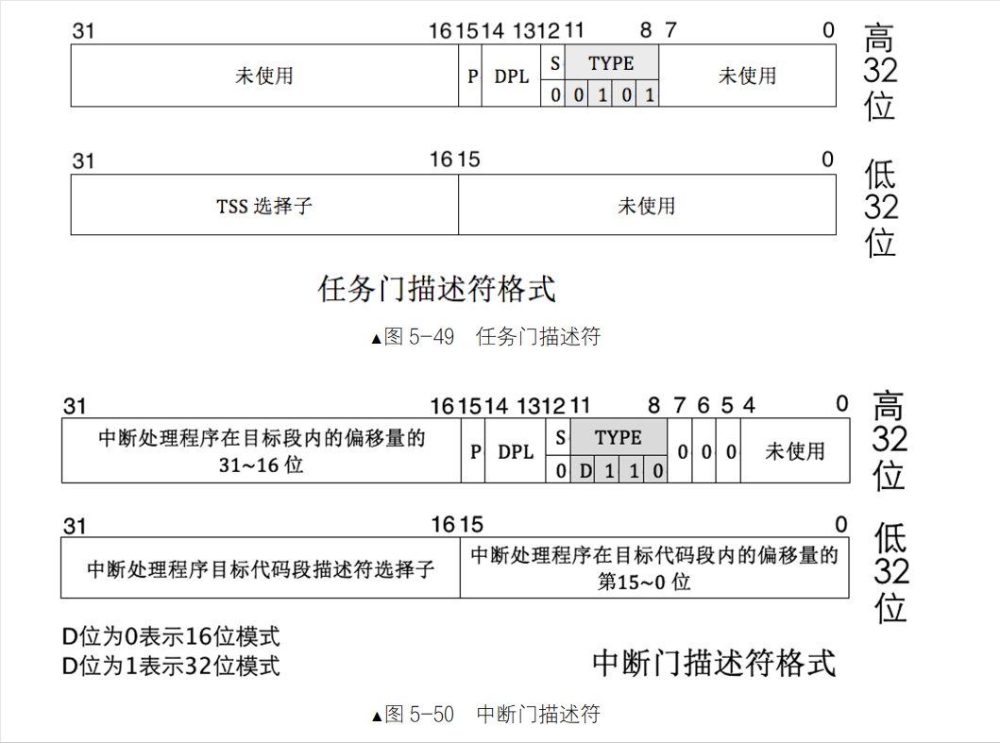

# 保护模式进阶，向内核迈进

## 获取物理量内存容量

### 学习 Linux 获取内存的方法
在Linux中有多种获取内存的方法，（其中最简单的方法是使用`/proc/meminfo`文件，该文件包含了系统内存的详细信息。我们可以通过读取该文件来获取内存容量。）可以用detect_memory函数来获取内存容量。这个函数是用0x15d 中断来实现的.

分别是 BIOS 中断 0x15 的 3 个子功能，子功能号要存放到寄存器 EAX 或 AX 中，如下。
- EAX=0xE820：遍历主机上全部内存。
- AX=0xE801： 分别检测低 15MB 和 16MB～4GB 的内存，最大支持 4GB。
- AH=0x88：最多检测出 64MB 内存，实际内存超过此容量也按照 64MB 返回

## 启用内存分页机制，畅游虚拟空间

### 为什么要分页
我们现在在一直都是在内存分段下工作，如果复杂起来后，分段机制就不够了，因为分段机制总不能直接分4G一个内存给一个程序用吧，或者将内存碎片给程序。

分页机制是计算机系统中非常重要的一种内存管理技术，它的主要目的是为了提高内存的利用率和系统的性能。分页机制将内存分成若干个大小相同的页，每个页都有一个页表项，页表项中存放着该页的物理地址。这样，我们只需要一个页表，就可以管理所有的页。

如果我们内存很大，比如 4GB，那么我们就要有 4GB 的页表，这显然是不现实的。所以，我们需要分页机制，将内存分成若干个大小相同的页，每个页都有一个页表项，页表项中存放着该页的物理地址。这样，我们只需要一个页表，就可以管理所有的页。

## 特权级深入浅出

### 2

任务门描述符  TYPE 0101
中断门描述符  TYPE D110
陷阱门描述符  TYPE D111
调用门描述符  TYPE D100

1. 调用门
call 和 jmp 指令后接调用门选择子为参数，以调用函数例程的形式实现从低特权向高特权转移，可用来实
现系统调用。call 指令使用调用门可以实现向高特权代码转移，jmp 指令使用调用门只能实现向平级代码转移。
2. 中断门
以 int 指令主动发中断的形式实现从低特权向高特权转移，Linux 系统调用便用此中断门实现，以后咱
们在实现中断时会展开细说。
3. 陷阱门
以 int3 指令主动发中断的形式实现从低特权向高特权转移，这一般是编译器在调试时用，本书中咱们
不用过多关注。
4. 任务门
任务以任务状态段 TSS 为单位，用来实现任务切换，它可以借助中断或指令发起。当中断发生时，
如果对应的中断向量号是任务门，则会发起任务切换。也可以像调用门那样，用 call 或 jmp 指令后接任务
门的选择子或任务 TSS 的选择子。

在返回时若需要改变特权级，处理器必须要检查所有数据段中的选择子，若 DS、ES、FS 和 GS 中
选择子所指向的数据段描述符的 DPL 权限比目标特权级高，处理器将把数值 0 填充到相应的段寄存器

GDT 中第 0 个段描述符是不可用的，称之为哑描述符

