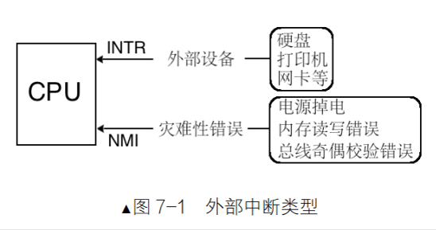
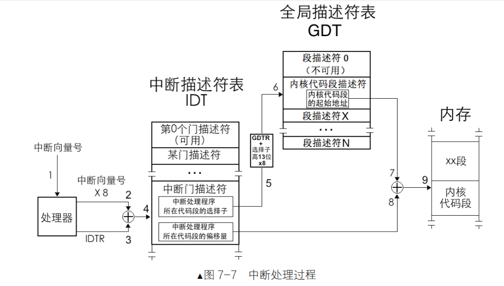
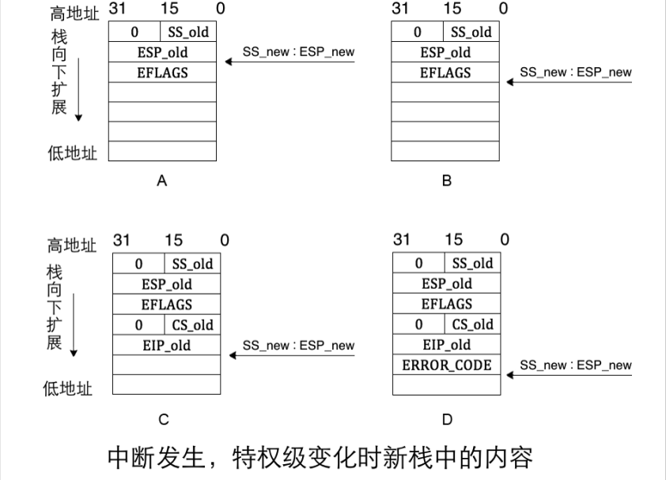
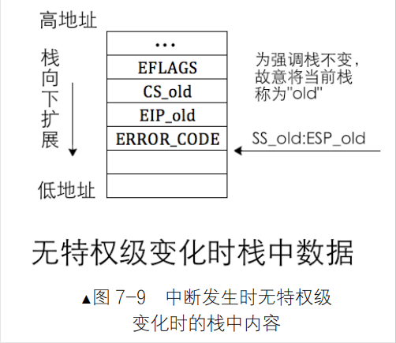
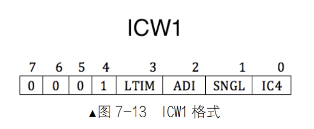
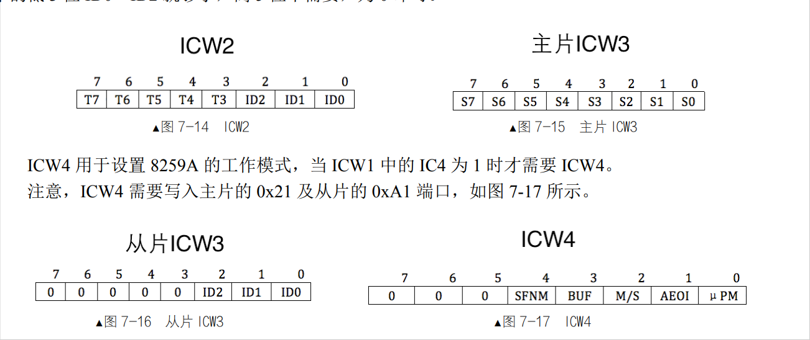
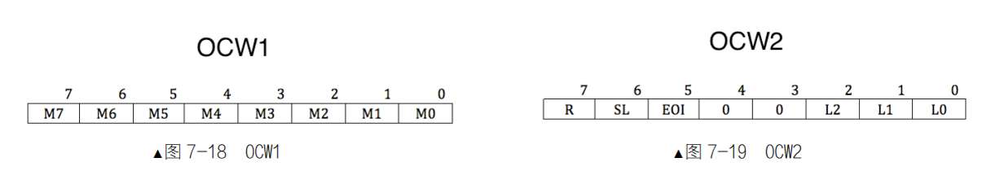
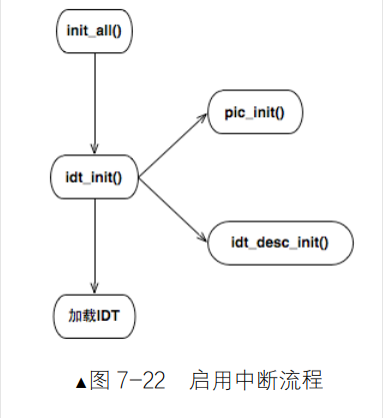

# 中断

## 7.1 中断的概念
    暂停现在干的自己的事情，去干别的但是对于整个系统有利的事情  
    
    如果只有一个cpu的话，任何程序都必须串行执行，效率低下
    
    中断为了在多任务系统中，让多个程序并发执行。
    
    运用中断能够显著提升并发，从而大幅提升效率。

## 7.2 操作系统是中断驱动的

    首先操作系统其实就是一个死循环，如果没有jmp $ 这种提留的话，程序就会一直执行下去它也许会把最后一条指令后面的数据解码成某种指令，也许会因为不识别该指令解码失败而抛出 UD 异常，即未定义操作码、无效操作码（Undefined，Invalid Opcode）。

## 7.3中断的分类

1. 外部中断（硬件中断）
- 中断源：某个硬件
    - 比如说网卡收到了来自网络的数据包，这时候网卡就会主动通知 CPU，CPU 得到通知后便将数据拷贝到内核缓冲区。
   
- CPU准备两条信号线 
    - CPU 提供统一的接口作为中断信号的公共线路，所有来自外设的中断信号都共享公共线路连接到 CPU）
    - 分别是：INTR（INTeRrupt） 和NMII（Non Maskable Interrupt），INTR 是可屏蔽中断，NMII 是不可屏蔽中断
         - INTR ：是外部设备，可屏蔽，随时处理，甚至可以不处理.
            - (可以通过 eflags 寄存器的 IF 标志位来屏蔽或打开中断，屏蔽后，CPU 不会响应中断信号)
            - 上下半分开处理： （上半处理）把中断处理程序中需要立即执行的部分（分分钟不能耽误的部分）划分到上半部，这部分是要限时执行的，所以通常情况下只完成中断应答或硬件复位等重要紧迫的工作。
            - 下半处理：（不紧急，推迟到下半）
            - 上下半处理，比如说网卡发来一个数据包，拿数据很急，所以就放到上半接收，放到内核缓存区，然而处理下半，比如说把数据包放到用户空间，这个就不急，就放到下半处理。
     
         - NMI ：是系统故障，比如电源故障，内存故障，系统崩溃等
            - 只是通知CPU一声而已。错误无法避免了
            -   CPU通过中断向量表或者中断描述符表（中断向量表是实模式下的中断处理程序数组，在保护模式下已经被中断描述符表代替）
            - 为导致宕机的原因分配一个中断向量号就好了
     

2. 内部中断（软件中断）

- 内部中断可分为软中断和异常。
    - 软中断：由指令引起，如 int 0x80。（因为它来自于软件）
        - 可以发起的指令：“int 8位立即数” 
        - “int3” int3是调试断点指令，触发的中断向量号是3
    - 异常
        - into：除0异常(中断溢出指令)中断向量号是4,
        - bound：数组越界异常，中断向量号是5
        - ud2:未定义指令，中断向量号是6，表示指令无效
        - 还有很多种啦
        - 分类： Fault(故障)，Trap(陷阱)，Abort(异常终止)
            - Fault: 比如说除0异常，缺页异常 page fault，CPU会先尝试修复，如果修复不了，就会抛出异常，进入内核态
            - Trap: 比如说 int 0x80，CPU会直接进入内核态
            - Abort: 最严重的异常，比如说 ud2，CPU会直接进入内核态
        
- 异常和NEI都无视标志寄存器eflags的IF标志位，软中断也无视IF标志位，所以异常和软中断都是不可屏蔽的（所以只有INTR会受IF位是吧！！哈哈哈哈）

## 7.4 中断描述符表（IDT）

- 中断描述符表（IDT）是`保护模式`下用于存储`中断程序入口`的表。
- 中断向量表（Interrupt Vector Table，IVT）是在`实模式`下存储`中断处理程序入口`的表

- 中断描述符表有中断描述符（乐）。还有任务门描述符，陷阱门描述符。

- IDT和IVY区别：
    - 中断描述符表不限制，那里都可以。
    - 中断描述符表中的每一个描述符用8字节描述。IVY每个中断向量用 4 字节描述

1. 中断处理过程及保护

- 发生中断处理过程分为CPU 内， CPU外。
    - CPU内：外部设备的中断由中断代理芯片接收，处理后将该中断的中断向量号发送到 CPU
    - CPU外：CPU 执行该中断向量号对应的中断处理程序。
- 中断处理过程：

1. 处理器根据中断向量号`定位`中断门描述符。
- 中断向量号是中断描述符的索引。
- 由于中断描述符是 8 个字节，所以处理器用中断向量号乘以 8 后，再与 IDTR 中的中断描述符表地址相加，所求的地址之和便是该中断向量号对应的中断描述符。
    
2. 处理器进行特权级检查
- 由于中断是通过中断向量号通知到处理器的，中断向量号只是个整数，其中并没有 RPL（访问特权级），所以在对由中断引起的特权级转移做特权级检查中，并不涉及到 RPL。
    - 由软中断 int n、int3 和 into 引发的中断,（用户进程主动发送的中断）。检查当前特权级CPL,和门描述符DPL，如果 CPL < DPL,则进行特权级转移。
    - 这一步检查特权级的上限（门框）:  比较当前特权级CPL和门描述符DPL，如果 CPL < DPL，则进行特权级转移。
3. 执行中断处理程序
- 特权级检查通过后，将门描述符目标代码段选择子加载到代码段寄存器 CS 中，把门描述符中中断处理程序的偏移地址加载到 EIP，开始执行中断处理程序。

- NF ->任务嵌套标志位（用来标记任务嵌套调用的情况）
    - （1）将旧任务TSS选择子写到了新任务TSS中的`上一个任务TSS的指针`字段中
    - （2）将新任务标志位寄存器eflags中的`NF`位置1，表示新任务之所以能够执行，是因为有`别的任务`调用了它。
        
        第（2）步中这个“别的任务”便是指 CPU 在第 1 步中写进新任务自己 TSS 的“上一个任务 TSS 的指针”字段中的值。
    
2. 中断发生时的压栈
（只讨论32位保护模式下）
- 中断发生，处理器收到一个`中断向量号`，根据此`中断向量号`在`中断描述符表`中找到相应的`中断门描述符`，`门描述符`中保存的是`中断处理程序`所在`代码段的选择子`及在`段内偏移量`，处理器从该`描述符`中加载`目标代码段选择子`到`代码段寄存器 CS `及`偏移量到指令指针寄存器 EIP`。

`中断向量号`-（中断描述符表）->`中断门描述符`-（保存）->`目标代码段选择子`-->`代码段寄存器CS`-->`偏移量`-->`指令指针寄存器EIP`。

不管目标选择段选择子，以及中断门描述符中偏移量是什么，都认为

## 7.5 可编程中断控制器 8259A

1. 8259A 的功能

- 管理和控制可屏蔽中断： 表现在屏蔽外设中断，对它们优先级判决，向CPU提供中断向量号功能。

- 级联: 因为CPU可以支持256个中断，而8259A只能管理8个中断，所以8259A可以级联，最多可以管理256个中断。最多可以级联9个8259A（也就是64个中断片）。
- 8个串口，ISR越小，优先级越高
1. 内部结构
- INT：向 CPU 发送中断请求信号。
- INTA：接收来自 CPU 的中断响应信号。
- IMR (Interrupt Mask Register)：用于屏蔽某些中断。
- IRR (Interrupt Request Register)：存储待处理的中断。
- PR (Priority Resolver)：用于判断中断的优先级。
- ISR (In-Service Register)：记录当前正在处理的中断。

2. 工作流程
- 中断信号到达：
    - 外部设备发出中断信号，8259A 接收到这个信号。
    - 检查 IMR 寄存器，判断该中断是否被屏蔽。
- 中断请求处理
    - 如果没有被屏蔽，则将该中断信号存入 IRR 寄存器，表示有待处理的中断。
    - PR 选择优先级最高的中断，将其发送给 CPU
-  CPU响应
    - CPU 完成当前指令后，通过 INTA 信号回传给 8259A，表示准备好处理新中断。
    - 8259A 将所选中断从 IRR 中移除，并在 ISR 中标记为正在处理的中断。
- 中断向量号传递
    - 8259A 通过数据总线将中断向量号发送给 CPU，CPU 使用该向量查找相应的中断处理程序。
- 结束中断处理
    - 如果 EOI（End Of Interrupt）通知设置为手动模式，ISR 中的 BIT 必须被清除。
    - 如果设置为自动模式，8259A 会在收到第二个 INTA 信号时自动处理。
3. 8259A 的编程

初始化：设置主片和从片的级联模式

(原因： 8259A的IRQ0~7被BIOS分配了0x8~0xf的中断号，但是保护模式下CPU已经占了这些中断号，要重新给8259A分配中断号)

- 两组寄存器：
    - 初始化命令寄存器组ICW 共 4 个，ICW1～ICW4 （initialzation command words）
    - 操作命令寄存器组OCW 共 3 个，OCW1～OCW3（operation command words）

- 初始化：
    - 因为ICW初始化，来确定是否需要级联，设置其实中断号，设置结束中断号，设置关联性，依赖性。因为设置会依赖前面某个ICW的设置，所以说，1——4的顺序不能乱。

- 操作：
    - 顺序可以不固定

### 每个ICW的详细说明

1. ICW1：初始化 8259A 的连接方式和中断信号的触发方式。
    - 触发方式：`中断请求信号`是 `电平触发` 还是  `边沿触发`。
    
    - ICW1需要写入到主片的0x20端口和从片的0xA0端口
- ICW1每一位 
    - IC4第0位，表示是否要写入 ICW4，（x86系统必须要为1）
    - SNGL表示single 如果为1——单片，0——级联。（如果是级联，考虑用那个IRQ接口）
    - ADI 表示 call address interval，来设置 8085 的调用时间间隔（x86 不需要设置）
    - LTIM 表示 level/edge triggered mode，用来设置中断检测方式，0——边缘触发，1——电平触发。
    - 第4位是固定的1 
    - 第 5～7 位专用于 8085 处理器，x86 不需要，直接置为 0 即可。
2. ICW2：设置起始中断向量号
- 地址
    - 主片通过端口 0x21 进行配置。
    - 从片通过端口 0xA1 进行配置。
- 中断向量号设置：
    - 只需设置 IRQ0 的中断向量号，其他 IRQ1～IRQ7 的中断向量号会依次跟随。
    - 由于只填写高 5 位（T3～T7），这意味着所设定的起始中断向量号必须是 8 的倍数。
    - 8259A 会根据 IRQ 接口的排列，将低 3 位（ID0～ID2）自动处理，例如：
        - IRQ0 的中断向量号对应 000。
        - IRQ1 的中断向量号对应 001。
        - IRQ2 的中断向量号对应 010，依此类推。
3.  ICW4：
- ICW4 用于设置 8259A 的工作模式，当 ICW1 中的 IC4 为 1 时才需要 ICW4。

### 每个OCW的详细说明
1. OCW1：屏蔽中断

## 7.6 中断处理程序

- 每发生一次时钟中断就打印一次interrupt occur！（发生中断时各个函数之间的调用）

1. 函数调用关系

- init_all()函数是用来初始化所有设备以及相关数据结构。（在主函数中来完成）

- init_all()首先调用idt_init()函数
    - idt_init()函数用初始化中断相关的内容,idt_init()函数中调用了pic_init()和idt_desc_init()函数(算作两个部分)。
        - pic_init()函数用来初始化8259A.
        - idt_desc_init()函数用来初始化中断描述符表。

2. 过程
- 汇编语言实现中断处理程序
    - ide_desc_init()函数中，