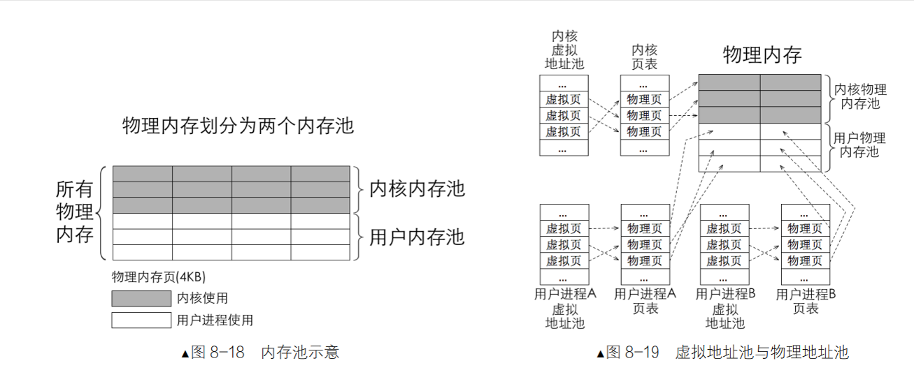

## ASSERT断言
```c
#ifndef _KERNEL_DEBUG_H
#define _KERNEL_DEBUG_H
void panic_spin(char *filename, int line, const char *func, const char *condition);
/*************************** __VA_ARGS__ ******************************* 
* __VA_ARGS__ 是预处理器所支持的专用标识符。
* 代表所有与省略号相对应的参数。
* "..."表示定义的宏其参数可变。*/ 

#define PANIC(...) panic_spin (__FILE__, __LINE__, __func__, __VA_ARGS__)  // LINE当前行号，func当前函数名，当前文件名
/***********************************************************************/ 
#ifdef NDEBUG
#define ASSERT(CONDITION) ((void)0)
#else
#define ASSERT(CONDITION) \
    if (CONDITION){}      \
    else                  \
    {PANIC(#CONDITION);}
/*符号#让编译器将宏参数转化为字符串字面量*/
/*断言是if*/
#endif /* NDEBUG */ 
#endif /* _KERNEL_DEBUG_H */
```

## 内存池规划


### 内存池——> 内存地址池
我们需要创建虚拟内存地址池和物理内存地址池

#### 如何规划内存物理池

1. 将物理内存分成两个内存池，一部分较用户物理内存池，只是用来分配给用户进程，另一部分是内核物理内存池，用来分配给内核进程

2. 取内存池的水，按单位是来获取的，单位大小是4kb，叫做页。（所以说内存池里面其实很多个4kb大小的内存块，只能拿4kb或者4kb 倍数的）


#### 虚拟内存地址池
1. 程序中的地址都是虚拟地址，其范围取决于地址总线的宽度，在32位的环境下，虚拟地址空间为4GB。




虚拟地址结构：
1. 高 10 位：页目录索引（Page Directory Index, PDI）
2. 中 10 位：页表索引（Page Table Index, PTI）
3. 低 12 位：页内偏移（Offset）

malloc_page 的原理是三个动作的合成:
1. 通过 vaddr_get 在虚拟内存池中申请虚拟地址
2. 通过 palloc 在物理内存池中申请物理页
3. 通过 page_table_add 将以上得到的虚拟地址和物理地址在页表中完成映射