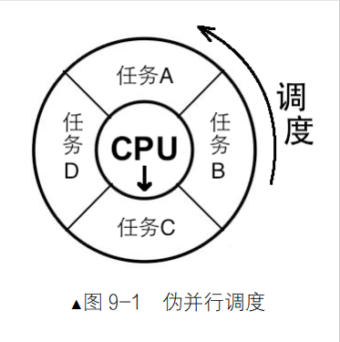
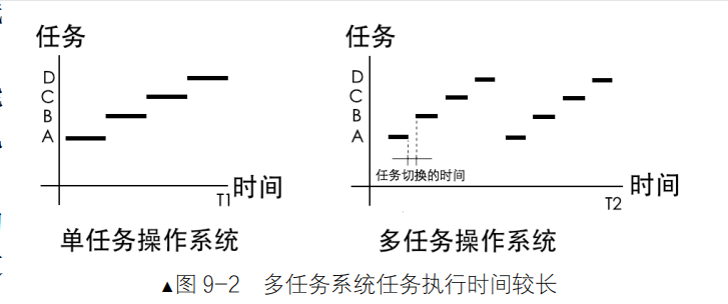
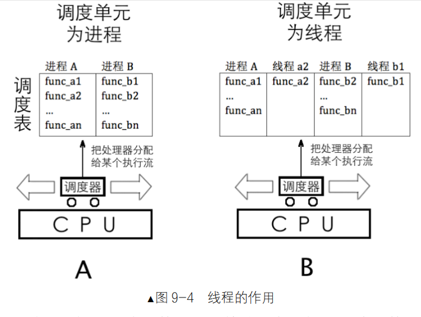
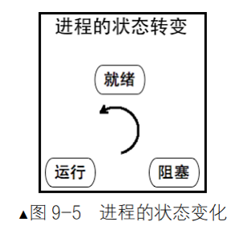
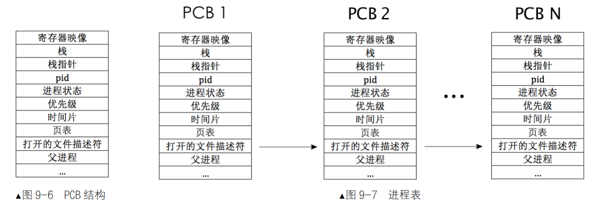
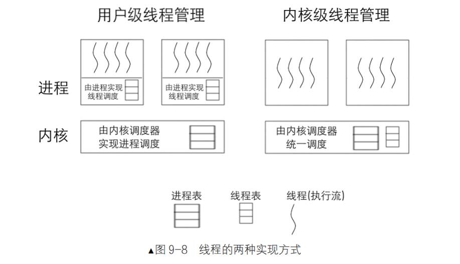

# 线程

## 实现内核线程

### 9.1.1执行流

1. 计算机只有一个处理器（单核），在其上运行的系统也是单任务操作系统，不管有多少任务，任务的执行都是串行的，一个任务执行完毕，才能开始下一个任务。

但现在非要让其兼顾所有的任务，唯一的做法是只能让每个任务各在处理器上执行一小会儿，然后再换下一个任务上处理器，直到所有任务都执行完毕。

这些事都是在任务调度器来完成的
#### 任务调度器

任务调度器就是`操作系统`中用于把`任务轮流调度`上处理器运行的一个`软件模块`，它是操作系统的一部分。

调度器在内核中维护一个任务表（也叫进程表，线程表，调度表），然后按照一定的算法，从任务表里面选择一个任务，把这个任务放到处理器上运行，当任务运行的时间片到期后，再从任务表中找到另外一个任务放到处理器上运行。

轮询的方法，来切换任务，但是其实原生的处理器，支持任务切换和相关结构。比如 TSS 结构和任务门， 但是我们没有用这个方法。

执行流就是一段逻辑上独立的指令区域，是人为给处理器安排的处理单元。指令是具有“能动性”的数据，因此只有指令才有“执行”的能力。

指令是由处理器来执行的，它引领处理器“前方”的方向，用“流”来表示处理中程序计数器的航向，借此比喻处理器来执行的。 它引领处理器“前进”的方向，用“流”来表示处理中程序计数器的航向，借此比喻处理器来执行的。

执行流对应代码，大概可以是整个程序文件，（进程），小到可以是一个功能独立代码块（函数），而线程本质上就是函数。

执行流是独立的，它的独立性体现在每一个执行流都有自己的栈，一套自己的寄存器映射和内存资源。这个inter处理器在硬件上规定的，其实这是处理器

## 进程和线程

1. 进程=线程+资源（线程是纯代码部分， 而进程是加上很多进程里的线程和进程的堆栈等内存资源（地址空间））

2. 所有线程享用同一个进程的资源，比如堆内存，全局变量，文件描述符等，而每个线程又拥有自己独立的栈内存，寄存器映射和程序计数器。

举个例子，比如在饭店里，只要有人点菜，厨房就要开始忙活。厨房就相当于进程，里面有食材和烹饪的锅具等，这些都是资源，在厨房中工作的人有厨师、配菜员、餐具清洁员等，他们都是进程中的线程。比如客人点了一盘鱼香肉丝，厨房中各类角色就要开始并行工作，配菜员开始准备食材，厨师负责烹饪，配菜员和厨师这两个线程是各干各的，但他们只能在厨房里工作，他们出了厨房后，什么都干不了，毕竟他们工作时所用的资源，即食材、锅具等都在厨房里，但他们每个人确实都可以分开工作，都是单独的执行流。

3. 每个进程都有自己的虚拟地址空间，正常情况下，进程之间都不能互相访问对方的地址空间。

4. 线程可以相互访问，其安全性是由人为负责的。只有线程才具备能动性，它才是处理器的执行单元，因此它是调度器眼中的调度单位 。进程只是个资源整合体

5. 执行流，调度单位，运行实体等概念都是针对线程而言的，

### 进程线程的状态

操作系统的调度器可以利用它更加高效地管理进程调度。

## 进程身份证 ——  PCB

PCB是Process Control Block的缩写，即程序控制块。——> 进程表项

进程状态：就绪，运行，阻塞

时间片：

寄存器隐射： 

页表：

进程栈：

PCB的作用
- PCB的引入是为了解决多个关键问题：
    - 进程调度：通过维护进程状态，调度程序可以有效管理哪些进程可以运行。
    - 上下文切换：寄存器映像的保存和恢复允许操作系统在不同进程间切换而不丢失状态。
    - 资源管理：将与进程相关的所有资源集中存储在PCB中，方便管理和调度。
    - 内存管理：页表的存在使得进程能够使用虚拟内存，提高了内存的利用率。

## 实现线程的两种方式 —— 内核或者用户进程

1. 在用户空间内实现线程

