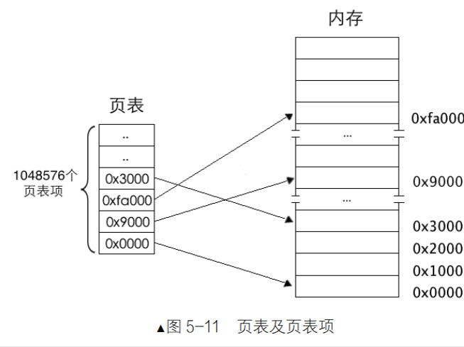
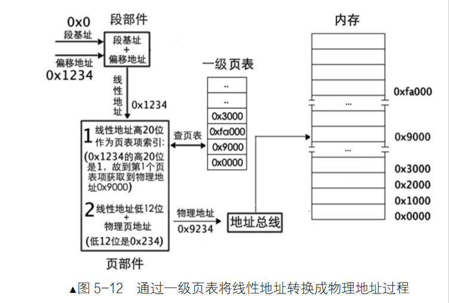

# 分页机制
## 为什么要分页
> 为了应对内存碎片过多，以及安全问题

比如说，5.4这里，当ABC三个进程同时运行时，内存是非常完美的。但是当B进程结束，D进程开始运行，如果D进程需要的内存有32MB,而现在 内存只有15+20M,没有办法拿出一个32M的整内存在存放D进程，这时候就需要内存分页机制。

这个时候有个方案 将进程 A 的段 A3 或进程 C 的段 C1 换出到硬盘上，腾出一部分空间，加上邻接的 20MB，足够容纳进程 D。

将A3或者更C1抛出内存，存储到外存中。

## 内存管理原理

1. 在保护模式下，段描述符是内存段的身份证，引用一个段的时候先看段描述符，很多时候段描述符在段描述符表里面，但是并不存在对应的内存。
- 如果段描述符里面P位为1,说明段在内存中存在。
- 如果段描述符的P位为0，说明段不在内存中，CPU会抛出一个NP异常。执行一个中断处理（缺页中断）。
- 访问过段的内存的时候A位变为1
    
2. 内存段是何时移出到外存上的呢？
- 段描述符中A位是为了得到该段的使用频率。
    - 描述符的 A 位由 CPU 置 1，但清 0 工作可是由操作系统来完成的。A每次A每次置1,操作系统都会给它置0.
    - 由这个A得到使用频率最低的内存段，可以把它移出内存。把它内存后，P 变成0,之后使用它会促发NP异常的中断。

3. 分页机制 -> 映射的方法

## 一级页表

- CPU地址变换
    - 分页机制其实是从分段机制上建立的。（因为CPU本来就支持分段啦～）
    - 分页只能在分段之后进行。 
    - 在分段机制上，如果提供一个段地址：段内偏移量的地址，CPU会直接认为是物理地址，如果是分页机制， CPU会先认为是虚拟地址（不能跳转到这个指向的物理地址里面），CPU还是要从这个虚拟地址里面拿到物理地址才行。

- 分页机制原理
    - 分页的思想
        - 通过映射，可以使任意地址与线性地址相关联，逻辑上连续的地址与其对应的物理地址不连续。
    - 分页作用：
        - 将线性地址转化为物理地址
        - 用大小相同的页代替大小不等的段
    
    从线性空间到虚拟空间再到物理地址空间，每个空间大小都是 4GB。
    1. 物理空间包含操作系统上所有的内存（这是个共享资源）
    2. 
- 页表结构
    - 虚拟地址空间可以是页表，也可以是操作系统维护的某种数据结构。
    - 这样就完成了虚拟页到物理页的映射，每个进程都以为自己独享 4GB 地址空间。
   
   如果采用这种线性地址与物理地址一一映射的方案。
（1）表中就应该有 4G 个页表项。
（2）32 位的地址要用 4 字节的页表项来存储，页表总共大小是 4Byte*4G =16GB。显然这有点好笑。

    所以将任意数值拆成高位和地位，就可以减少内存大小

有滑动滑块，调整内存块尺寸和内存块数量（内存块->页）

    32 位低 20 位是页内偏移量，32 位高 12 位是页表索引。
内存块数*内存块大小=4GB。（这里刚刚好）
- 一级页表模型
     
     - 32位地址空间一共有1M（1048756）个物理页，所以首先是要定位到能一个物理页。，然后找到在这个物理页的偏移量就能到内存。

- 页表项
    -  分页机制打开前要将页表地址加载到控制寄存器 cr3 中，这是启用分页机制的先决条件之一。
        - 所以，在打开分页机制前加载到寄存器 cr3 中的是页表的物理地址，页表中页表项的地址自然也是物理地址了
    - 虽然内存分页机制的作用是将虚拟地址转换成物理地址，但其转换过程相当于在关闭分页机制进行，过程中所涉及到的页表及页表项的寻址，它们的地址都被 CPU 当作最终的物理地址（本来也是物理地址）直接送上地址总线，不会被分页机制再次转换（否则会递归转换下去）
    - 页表项的地址是物理地址，所以页表项的地址是固定的，不会随着分页机制打开而改变，所以页表项的地址可以存储在只读存储器中，这样，即使分页机制打开，页表项的地址也不会改变，从而保证了分页机制的正确性。
    - 页表项的地址是固定的，所以页表项的地址可以存储在只读存储器中，这样，即使分页机制打开，页表项的地址也不会改变，从而保证了分页机制的正确性。
    
    

